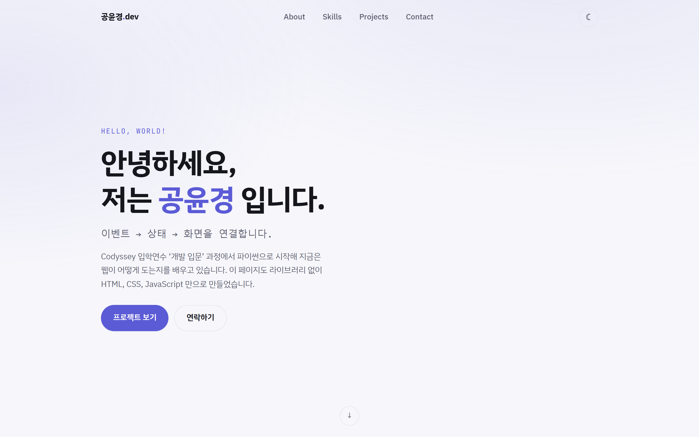
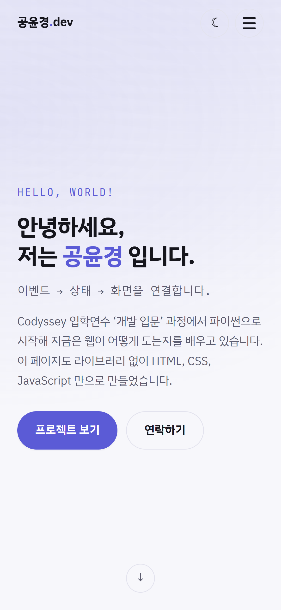
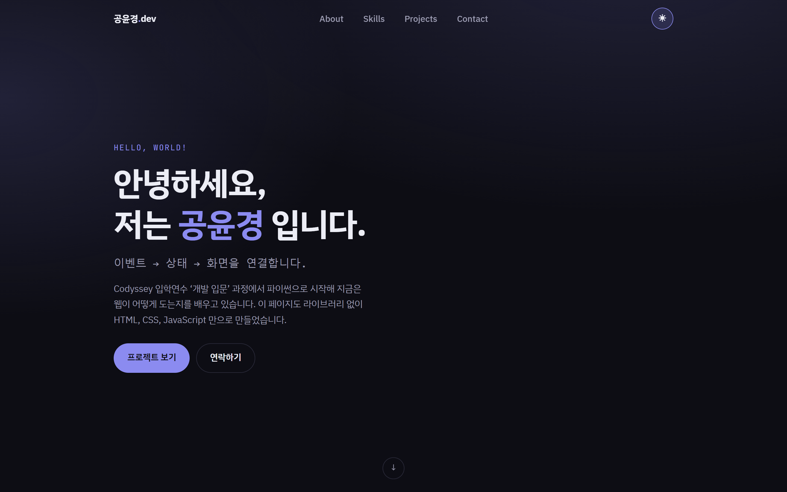
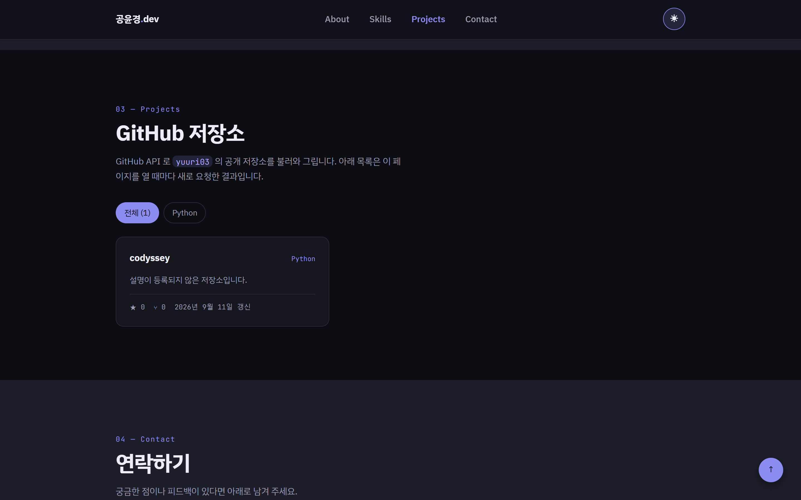
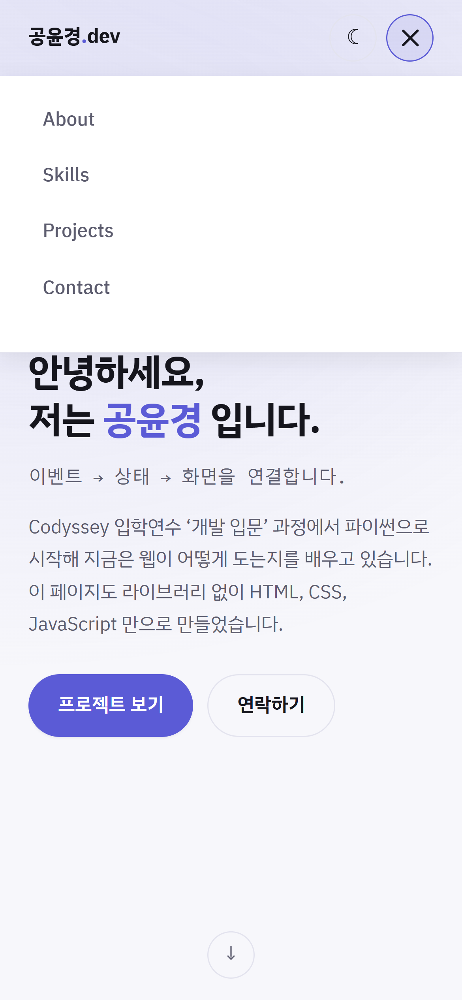
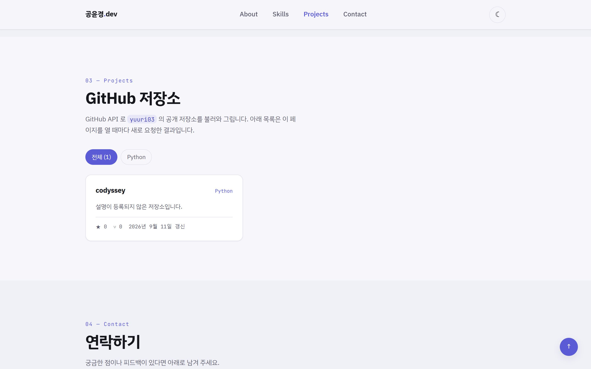
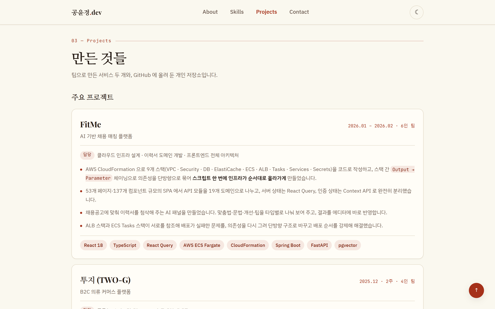
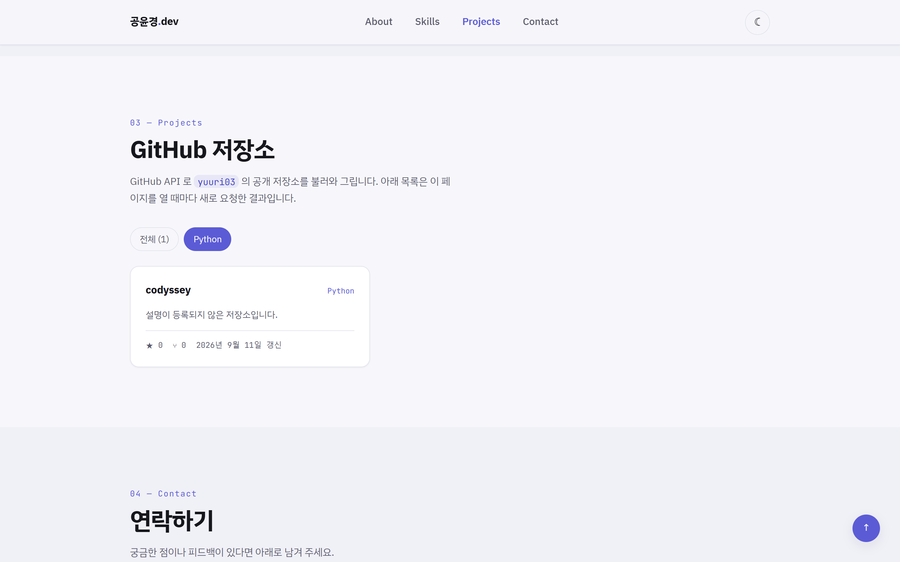
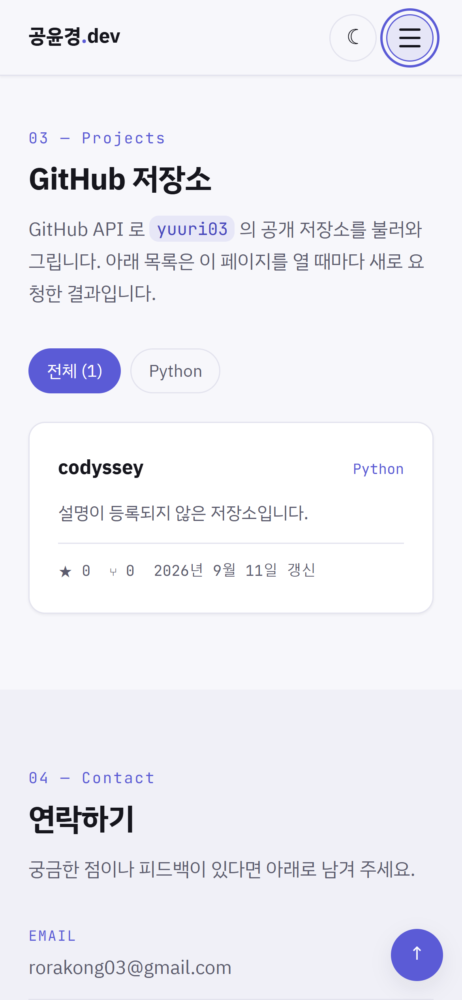
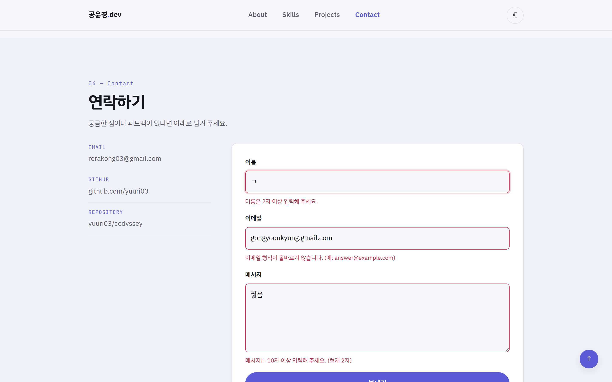

# 나를 소개하는 웹페이지

외부 라이브러리 없이 HTML, CSS, JavaScript 만으로 만든 반응형 포트폴리오
웹사이트입니다. 화면을 예쁘게 그리는 것보다 **사용자 이벤트 → 상태 변경 →
화면 갱신**이 어떻게 이어지는지를 코드에 드러내는 데 중심을 두었습니다.

- 배포 주소: <https://yuuri03.github.io/codyssey/portfolio-website/>
- 개발·확인 환경: Chrome 최신 버전, VS Code + Live Server
- 외부 의존성: 없음 (웹 폰트 Google Fonts 만 사용)

## 목차

1. [무엇을 만들었는가](#1-무엇을-만들었는가)
2. [실행 방법](#2-실행-방법)
3. [동작 확인](#3-동작-확인)
4. [구조](#4-구조)
5. [구현 흐름](#5-구현-흐름)
6. [설계 판단](#6-설계-판단)
7. [동작 기준값](#7-동작-기준값)
8. [배포](#8-배포)
9. [이번 미션에서 하지 않은 것](#9-이번-미션에서-하지-않은-것)

---

## 1. 무엇을 만들었는가

브라우저가 직접 이해하는 언어는 HTML, CSS, JavaScript 세 가지뿐입니다.
React 나 Vue 로 쓴 코드도 결국 이 셋으로 바뀌어 돌아갑니다. 그래서 프레임워크를
배우기 전에 그 아래에서 무슨 일이 일어나는지를 먼저 확인해 보려고 만들었습니다.

페이지는 여섯 섹션으로 이루어집니다.

| 섹션 | 내용 |
| --- | --- |
| Hero | 인사말과 두 개의 CTA 버튼 |
| About | 프로필 이미지와 자기소개 |
| Skills | 실제로 미션에서 써 본 기술만 카드로 정리 |
| Projects | GitHub API 로 불러온 저장소 목록 |
| Contact | 연락처와 문의 폼 |
| Footer | 저작권과 소셜 링크 |

### 사용 기술

| 구분 | 사용한 것 |
| --- | --- |
| 마크업 | HTML5 시맨틱 태그 (`header`, `nav`, `main`, `section`, `article`, `footer`) |
| 스타일 | CSS 변수, Flexbox, Grid, 미디어 쿼리, `transition`, `box-shadow` |
| 스크립트 | ES6+ (화살표 함수, 템플릿 리터럴, 구조분해 할당, `async`/`await`) |
| 브라우저 API | `fetch`, `localStorage`, `IntersectionObserver`, `matchMedia`, `requestAnimationFrame` |
| 외부 데이터 | GitHub REST API (`/users/{id}/repos`) |
| 배포 | GitHub Pages |

---

## 2. 실행 방법

정적 파일뿐이라 `index.html` 을 브라우저로 바로 열어도 동작하지만, VS Code 의
Live Server 로 여는 것을 권합니다. 파일을 고치면 브라우저가 알아서 새로고침되고,
`file://` 이 아닌 `http://` 로 열리므로 실제 배포 환경과 조건이 같아집니다.

```
1. VS Code 에서 이 폴더(portfolio-website)를 연다.
2. 확장 'Live Server' 를 설치한다.
3. index.html 에서 우클릭 → 'Open with Live Server'
```

터미널만 있다면 파이썬 내장 서버로도 됩니다.

```bash
cd portfolio-website
python -m http.server 8000   # http://localhost:8000
```

---

## 3. 동작 확인

아래 화면은 모두 실제로 브라우저에서 조작해 얻은 것입니다.

### 3.1 창을 줄이면 레이아웃이 모바일에 맞게 바뀐다

기준은 두 곳입니다. **768px** 에서 메뉴가 헤더 안팎을 오가고, **1024px** 에서
여백과 카드 최소 폭이 커집니다.

| 폭 | 달라지는 것 |
| --- | --- |
| 768px 미만 | 메뉴가 화면 밖으로 빠지고 햄버거 버튼만 남는다. About·Contact 가 1열 |
| 768px 이상 | 메뉴가 헤더 안으로 들어오고 햄버거가 사라진다. About·Contact 가 2열 |
| 1024px 이상 | 좌우 여백과 본문 글자 크기를 키우고, 카드 최소 폭이 16rem → 18rem |

Skills 와 Projects 의 카드 격자는 미디어 쿼리 없이도 열 수가 바뀝니다.
`auto-fit` 이 "칸 하나가 최소 16rem 은 되어야 한다" 는 조건만 보고 몇 열이
들어갈지 스스로 계산하기 때문입니다.

확인하려면 개발자 도구(F12)의 기기 툴바를 켜고 폭을 390px 부근까지 줄이면 됩니다.

| 데스크톱 (1440px) | 모바일 (390px) |
| --- | --- |
|  |  |

### 3.2 테마 토글이 전환되고, 새로고침 뒤에도 남는다

헤더 오른쪽 버튼을 누르면 페이지 전체 색이 바뀝니다. 선택한 테마는
로컬스토리지에 저장되므로, 새로고침하거나 브라우저를 껐다 켜도 그대로 유지됩니다.





새로고침했을 때 라이트 화면이 한 번 번쩍이지 않도록, 테마를 정하는 코드만
`<head>` 안에 짧은 인라인 스크립트로 두었습니다. 자세한 이유는
[4.1](#41-html-css-javascript-를-나눈-이유) 에 적었습니다.

### 3.3 햄버거 메뉴, 스크롤 애니메이션, 맨 위로 버튼

| 기능 | 동작 |
| --- | --- |
| 햄버거 메뉴 | 버튼을 누르면 메뉴가 내려오고 세 줄이 X 로 바뀐다. 다시 누르거나, 메뉴 밖을 누르거나, Esc 를 누르거나, 창이 768px 이상으로 넓어지면 닫힌다 |
| 부드러운 스크롤 | 메뉴를 누르면 해당 섹션까지 부드럽게 이동한다. 고정 헤더에 제목이 가리지 않도록 `scroll-padding-top` 만큼 내려서 멈춘다 |
| 스크롤 애니메이션 | 섹션이 화면에 20% 들어오면 아래에서 위로 떠오르며 나타난다 |
| 헤더 배경 | 60px 넘게 스크롤하면 헤더에 반투명 배경과 아래쪽 경계선이 생긴다 |
| 맨 위로 버튼 | 300px 넘게 스크롤하면 오른쪽 아래에 나타나고, 누르면 맨 위로 부드럽게 올라간다 |
| 현재 섹션 표시 | 지금 보고 있는 섹션의 메뉴 글자가 강조된다 |



### 3.4 GitHub API 의 네 가지 상태가 구분된다

Projects 섹션은 요청 결과에 따라 네 화면 중 하나만 보여 줍니다.

| 상태 | 조건 | 화면 |
| --- | --- | --- |
| 로딩 | 요청을 보낸 직후 | 스피너와 "불러오는 중..." |
| 성공 | 응답을 받고 저장소가 1개 이상 | 카드 목록 |
| 빈 데이터 | 응답은 받았지만 저장소가 0개 | "표시할 프로젝트가 없습니다" |
| 에러 | 응답이 실패했거나 네트워크가 끊김 | "프로젝트를 불러올 수 없습니다" + 다시 시도 버튼 |

| 성공 | 에러 |
| --- | --- |
|  |  |

성공 화면 위에는 **언어별 필터 버튼**이 함께 나타납니다. 버튼 목록은 코드에 미리
적어 둔 것이 아니라 받아 온 저장소에서 뽑아 만들기 때문에, 새 언어로 저장소를
만들면 버튼도 저절로 늘어납니다. 고른 언어에 해당하는 저장소가 하나도 없으면
"조건에 맞는 프로젝트가 없습니다" 를 보여 줍니다.



에러 화면은 GitHub 이 403 을 돌려주는 상황을 흉내 내 받아 낸 것입니다.
인증 없이 GitHub API 를 부르면 시간당 60회까지만 허용되는데, 그 한도를 넘긴
경우에는 아래처럼 원인과 대처를 함께 알려 줍니다.

> GitHub API 요청 한도를 넘었습니다. 인증 없이 호출하면 시간당 60회까지만
> 가능하니 잠시 뒤에 다시 시도해 주세요.

모바일에서도 같은 카드가 1열로 쌓입니다.



### 3.5 폼이 즉각적인 피드백을 준다

빈 값과 형식 오류를 **입력 칸 바로 아래**에 한국어로 표시하고, 잘못된 칸의
테두리를 붉게 바꿉니다.

| 항목 | 규칙 | 어겼을 때 |
| --- | --- | --- |
| 이름 | 필수, 2자 이상 | "이름을 입력해 주세요." / "이름은 2자 이상 입력해 주세요." |
| 이메일 | 필수, `아이디@도메인.최상위` 형식 | "이메일 형식이 올바르지 않습니다. (예: answer@example.com)" |
| 메시지 | 필수, 10자 이상 | "메시지는 10자 이상 입력해 주세요. (현재 2자)" |



제출에 실패하면 첫 번째 잘못된 칸으로 초점이 옮겨 가고, 통과하면 성공 메시지를
띄운 뒤 폼을 비웁니다. 학습용 페이지라 실제로 메일이 전송되지는 않습니다.

피드백 시점은 두 단계로 나눴습니다. **제출할 때는 모든 칸을 검사**하고,
**입력하는 동안에는 이미 에러가 떠 있는 칸만** 다시 검사합니다. 첫 글자를
치자마자 "2자 이상 입력해 주세요" 가 뜨면 도움이 아니라 방해가 되기 때문입니다.

---

## 4. 구조

### 4.1 HTML, CSS, JavaScript 를 나눈 이유

세 언어는 각각 다른 질문에 답합니다.

| 파일 | 답하는 질문 | 이 프로젝트에서 |
| --- | --- | --- |
| `index.html` | 이 페이지에 **무엇이** 있는가 | 여섯 섹션의 구조와 내용 |
| `css/style.css` | 그것이 **어떻게 보이는가** | 색, 배치, 반응형, 다크 모드 |
| `js/*.js` | 그것이 **어떻게 움직이는가** | 이벤트 처리, 상태 관리, API 호출 |

한 파일에 섞어 쓰면 당장은 짧아 보이지만 세 가지를 잃습니다.

- **캐시**: 브라우저는 CSS 와 JS 를 따로 저장해 둡니다. 나뉘어 있으면 내용을
  한 글자 고쳐도 스타일과 스크립트는 다시 내려받지 않습니다.
- **재사용**: 페이지를 하나 더 만들 때 `<link>` 한 줄이면 같은 스타일을 씁니다.
  섞여 있으면 복사해 붙여야 하고, 그 순간부터 두 벌이 따로 놉니다.
- **찾기**: 색이 이상하면 CSS 만, 버튼이 안 눌리면 JS 만 보면 됩니다.

```
portfolio-website/
├── index.html              페이지 전체 마크업
├── css/
│   └── style.css           디자인 토큰, 레이아웃, 반응형, 다크 모드
├── js/
│   ├── theme.js            다크 모드
│   ├── navigation.js       햄버거 메뉴, 부드러운 스크롤
│   ├── scroll.js           헤더 배경, 맨 위로 버튼, 등장 애니메이션, 현재 섹션
│   ├── projects.js         GitHub API 연동과 상태별 렌더링
│   └── contact-form.js     문의 폼 유효성 검사
├── images/
│   ├── profile.svg         프로필 이미지
│   └── favicon.svg         파비콘
└── README.md
```

스크립트를 다섯으로 더 나눈 기준은 **파일 하나가 책임지는 상태를 하나로** 두는
것입니다. 다크 모드가 이상하면 `theme.js` 만, 저장소 목록이 안 나오면
`projects.js` 만 보면 됩니다. 파일마다 즉시 실행 함수로 감싸 두어 `const` 이름이
서로 부딪히지 않습니다.

연결은 모두 `defer` 로 합니다.

```html
<script defer src="js/theme.js"></script>
```

`defer` 는 HTML 을 읽는 중에 스크립트를 내려받되 **실행은 문서를 다 읽은 뒤로**
미룹니다. 이 속성이 없으면 브라우저가 태그를 만나는 순간 HTML 읽기를 멈추고
스크립트를 실행하는데, 그때는 아직 아래쪽 요소가 만들어지지 않아
`querySelector` 가 `null` 을 돌려줍니다.

예외로 `<head>` 에 짧은 인라인 스크립트를 하나 두었습니다.

```html
<script>
  document.documentElement.dataset.theme = saved || 'light';
</script>
```

테마 적용까지 `defer` 에 맡기면 문서를 다 읽은 뒤에야 어두워지므로, 다크 모드를
쓰는 사람에게 라이트 화면이 한 번 번쩍입니다. 첫 화면이 그려지기 전에 끝나야
하는 이 한 줄만 인라인으로 두었습니다.

### 4.2 시맨틱 태그를 고른 기준

`div` 는 "여기 상자가 하나 있다" 는 것 말고는 아무것도 알려주지 않습니다.
같은 자리에 `nav` 를 쓰면 브라우저와 스크린 리더, 검색 엔진이 모두 "이건 이
문서의 길잡이다" 라고 읽습니다. 화면에 보이는 모습은 같지만 전달되는 정보가
다릅니다.

태그를 고른 기준은 하나입니다.

> 이 덩어리가 무엇인지 한 문장으로 말할 수 있으면 시맨틱 태그를,
> 말할 수 없고 배치를 위해서만 필요하면 `div` 를 쓴다.

| 태그 | 쓴 곳 | 그렇게 정한 이유 |
| --- | --- | --- |
| `header` | 페이지 맨 위 고정 영역 | 문서 전체의 머리말 |
| `nav` | 로고와 메뉴 | 다른 곳으로 가는 링크 묶음 |
| `main` | Hero 부터 Contact 까지 | 이 문서의 본문. 페이지에 하나만 둔다 |
| `section` | 여섯 개 섹션 | 제목을 가진 주제 단위 |
| `article` | Skills 카드, Projects 카드 | 떼어 놓아도 그 자체로 말이 되는 조각 |
| `figure` / `figcaption` | 프로필 이미지와 이름 | 그림과 그 설명의 묶음 |
| `footer` | 저작권과 소셜 링크 | 문서 전체의 꼬리말 |
| `div` | `.about`, `.skills`, `.contact` 등 | 배치를 위한 상자. 의미가 없다 |

Projects 카드에 `article` 을 쓴 것은, 저장소 카드 하나만 떼어 다른 곳에 붙여도
"이런 저장소가 있다" 는 뜻이 그대로 남기 때문입니다. 반대로 카드를 담는
`.projects__grid` 는 격자로 늘어놓기 위한 상자일 뿐이라 `div` 로 두었습니다.

시맨틱 태그로 실제로 얻는 것은 세 가지입니다.

- **보조 기술**: 스크린 리더 사용자는 `main` 으로 건너뛰거나 제목만 훑어 문서를
  탐색합니다. 전부 `div` 면 이 이동이 불가능합니다.
- **검색 엔진**: `header`, `main`, `footer` 의 구분으로 본문이 어디인지 판단합니다.
- **코드를 읽는 사람**: 닫는 태그가 `</div>` 뿐이면 어느 상자가 닫히는지 알 수
  없지만, `</section>` 과 `</footer>` 는 그 자체로 표시가 됩니다.

그 밖에 접근성을 위해 지킨 것들입니다.

- 모든 이미지에 `alt` 를 적었습니다. 내용을 전달하는 그림이므로 "프로필 이미지"
  로 끝내지 않고 무엇이 그려져 있는지까지 적었습니다.
- 폼의 `label` 은 `for` 와 입력 칸의 `id` 를 맞췄습니다. 글자를 눌러도 입력 칸에
  초점이 가고, 스크린 리더가 칸의 이름을 읽어 줍니다.
- 에러 메시지 자리는 `aria-describedby` 로 입력 칸과 이어 두었습니다.
- 맨 앞에 본문으로 건너뛰는 링크를 두었습니다. 평소에는 화면 밖에 있다가 탭 키로
  초점이 오면 나타납니다.

### 4.3 CSS 변수로 얻은 것

색, 간격, 모서리, 그림자를 `:root` 에 모으고, 다크 모드는 `[data-theme="dark"]`
에서 **색 변수만 다시 정의**합니다.

```css
:root {
  --color-bg: #f7f7fb;
  --color-text: #16161d;
  --color-accent: #5b5bd6;
}

[data-theme='dark'] {
  --color-bg: #0d0d14;
  --color-text: #ecedf5;
  --color-accent: #8b8bf0;
}
```

이 프로젝트에서 실제로 얻은 이점이 네 가지입니다.

**하나, 다크 모드가 규칙 한 벌로 끝납니다.** `background-color: var(--color-bg)`
한 줄이 두 테마 모두를 처리합니다. 변수를 쓰지 않았다면 다크 모드용 규칙을
통째로 한 벌 더 써야 하고, 그러면 규칙이 두 벌로 갈라져 한쪽만 고치는 실수가
반드시 생깁니다.

**둘, 고칠 곳이 한 곳입니다.** 강조색을 바꾸려면 `--color-accent` 한 줄만
바꾸면 됩니다. 이 색은 버튼, 링크 호버, 태그, 파비콘 강조, 섹션 번호, 스피너,
포커스 테두리까지 열 곳이 넘게 쓰입니다.

**셋, 값에 이름이 생깁니다.** `#5b5bd6` 은 그냥 숫자지만
`--color-accent` 는 "이 사이트의 강조색" 이라는 뜻입니다. 나중에 코드를 읽을 때
그 색이 왜 거기 있는지 알 수 있습니다.

**넷, 간격이 흐트러지지 않습니다.** `--space-1` 부터 `--space-9` 까지를 4px
배수로 정해 두고 그 안에서만 고릅니다. 눈대중으로 `13px`, `18px` 을 섞어 쓰면
화면이 미묘하게 어긋나는데, 고를 수 있는 값을 제한하면 그런 일이 없습니다.

SASS 같은 전처리기 변수와 달리 CSS 변수는 **브라우저가 실행 중에 값을 바꿀 수
있습니다.** 다크 모드가 자바스크립트 한 줄(`data-theme` 속성 변경)로 끝나는 것도
이 성질 덕분입니다.

### 4.4 `onclick` 대신 `addEventListener` 를 쓴 이유

HTML 에 `onclick="toggleTheme()"` 이라고 적는 방법도 있지만 쓰지 않았습니다.

```javascript
const toggleButton = document.querySelector('#theme-toggle');

toggleButton.addEventListener('click', () => { ... });
```

두 방식의 차이를 항목별로 비교하면 이렇습니다.

| 비교 항목 | `onclick` 속성 | `addEventListener` |
| --- | --- | --- |
| 코드가 있는 곳 | HTML 안에 동작이 섞인다 | 구조는 HTML, 동작은 JS 로 분리된다 |
| 개수 | 한 이벤트에 **하나만**. 두 번 쓰면 앞의 것이 덮인다 | 같은 이벤트에 **여러 개**를 붙일 수 있다 |
| 제거 | 속성을 지우는 것 말고 방법이 없다 | `removeEventListener` 로 뗀다 |
| 함수의 위치 | 전역에 있어야 한다. 이름이 부딪힐 수 있다 | 즉시 실행 함수 안에 숨겨 둘 수 있다 |
| 이벤트 정보 | `event` 를 넘기려면 `onclick="f(event)"` 로 직접 적어야 한다 | 콜백의 첫 인자로 항상 들어온다 |
| 단계 조절 | 버블링 단계만 가능 | 캡처 단계, `once`, `passive` 등을 지정할 수 있다 |
| 동적으로 만든 요소 | 만들 때마다 문자열에 속성을 넣어야 한다 | 부모에 한 번만 붙여 위임할 수 있다 |

마지막 줄이 이 프로젝트에서 실제로 필요했던 지점입니다. Projects 의 "다시 시도"
버튼은 `render()` 가 화면을 그릴 때마다 새로 만들어지므로, 만들어질 때마다
리스너를 다시 붙여야 합니다. 대신 바깥 상자에 한 번만 붙여 두고 누가 눌렸는지
확인하는 방식(이벤트 위임)을 썼습니다.

```javascript
statusBox.addEventListener('click', (event) => {
  if (event.target.closest('[data-retry]')) {
    loadRepos();
  }
});
```

변수도 같은 이유로 `const` 를 기본으로 쓰고, 값이 바뀌는 것만 `let` 으로 두었으며
`var` 는 쓰지 않았습니다. `var` 는 블록을 무시하고 함수 전체에서 살아남아,
`if` 나 `for` 안에서 만든 변수가 바깥까지 새어 나가기 때문입니다.

---

## 5. 구현 흐름

### 5.1 이벤트 → 상태 변경 → 화면 갱신

이 페이지에는 같은 모양의 흐름이 세 군데 있습니다. 공통점은 **화면을 바꾸는
코드가 한 곳에만 있다**는 것입니다. 이벤트 처리기는 상태만 바꾸고, 화면 갱신은
그 상태를 읽는 함수 하나가 맡습니다.

#### 다크 모드를 예로 코드를 따라가면

```
① 클릭 이벤트        ② 상태 변경              ③ 화면 갱신
버튼 누름       →   theme = 'dark'      →   <html data-theme="dark">
                    localStorage 저장        CSS 변수가 통째로 교체됨
```

**① 이벤트** — 버튼을 잡고 클릭에 함수를 연결합니다.

```javascript
toggleButton.addEventListener('click', () => {
  const nextTheme = root.dataset.theme === 'dark' ? 'light' : 'dark';

  applyTheme(nextTheme);
  writeStored(nextTheme);
});
```

**② 상태 변경** — 상태는 `<html>` 의 `data-theme` 속성 **하나뿐**입니다.
`applyTheme()` 이 그 값을 바꾸고, 버튼의 아이콘과 `aria-pressed` 도 같은 함수
안에서 함께 맞춥니다. 상태와 화면이 어긋날 자리를 만들지 않기 위해서입니다.

```javascript
const applyTheme = (theme) => {
  const isDark = theme === 'dark';

  root.dataset.theme = theme;
  toggleIcon.textContent = isDark ? '☀' : '☾';
  toggleButton.setAttribute('aria-pressed', String(isDark));
  toggleButton.setAttribute('aria-label', isDark ? '라이트 모드로 전환' : '다크 모드로 전환');
};
```

**③ 화면 갱신** — 여기서 자바스크립트는 색을 하나도 바꾸지 않습니다.
속성이 바뀌는 순간 CSS 의 `[data-theme="dark"]` 규칙이 걸리면서 변수 값이 전부
교체되고, 그 변수를 쓰던 모든 곳의 색이 한꺼번에 바뀝니다.

**유지되는 이유** — 바뀐 값을 `localStorage` 에 남겨 두고, 다음 방문 때
`<head>` 의 인라인 스크립트가 그 값을 먼저 읽어 적용하기 때문입니다.
시크릿 모드나 저장이 막힌 환경에서는 `localStorage` 접근 자체가 예외를 던지므로,
읽기와 쓰기를 모두 `try/catch` 로 감싸 테마 하나 때문에 페이지가 멈추지 않게
했습니다.

#### 나머지도 같은 모양입니다

```
[Projects — 데이터 요청]
페이지 열림 / 다시 시도 클릭
      ↓
state.status = 'loading'                       →  render()  →  스피너
      ↓ fetch
성공: state.status = 'success', state.repos    →  render()  →  카드 목록
실패: state.status = 'error',   errorMessage   →  render()  →  안내 + 다시 시도

[Projects — 언어 필터]
필터 버튼 클릭  →  state.language = 'Python'  →  render()  →  목록과 버튼 강조 갱신

[문의 폼]
제출 클릭  →  preventDefault()  →  칸마다 검증 → 에러 문장 결정
                                                    ↓
                                        renderError() → 메시지 표시/숨김
                                                      → 입력 칸 테두리 색
```

언어 필터가 이 구조의 이점을 가장 잘 보여 줍니다. 버튼을 누르는 코드는
`setState({ language: button.dataset.language })` 한 줄이 전부입니다. 카드를
지우거나 버튼의 강조를 옮기는 코드는 어디에도 없습니다. 상태가 바뀌면
`render()` 가 그 상태를 보고 목록과 버튼을 **함께** 다시 그리기 때문에, 목록만
바뀌고 버튼 강조는 그대로 남는 식으로 둘이 어긋날 수 없습니다.

폼의 검증 함수는 화면을 건드리지 않고 "무엇이 잘못됐는지" 를 문장으로만
돌려줍니다. 그 문장을 화면에 반영하는 것은 `renderError()` 하나뿐입니다.
덕분에 검증 규칙을 바꿀 때 DOM 코드를 건드릴 일이 없습니다.

### 5.2 `async`/`await` 와 `try`/`catch` 의 성공·실패 분기

```javascript
const loadRepos = async () => {
  setState({ status: 'loading', errorMessage: '' });        // ① 로딩으로

  try {
    const response = await fetch(REPOS_URL, {               // ② 응답을 기다림
      headers: { Accept: 'application/vnd.github+json' },
    });

    if (!response.ok) {                                     // ③ 실패 코드면 직접 던짐
      throw new Error(await describeError(response));
    }

    const data = await response.json();                     // ④ 본문 해석

    setState({ status: 'success', repos: data.sort(...) }); // ⑤ 성공으로
  } catch (error) {                                         // ⑥ ②③④ 어디서 터져도 여기로
    const message =
      error instanceof TypeError
        ? '네트워크에 연결할 수 없습니다. 인터넷 상태를 확인한 뒤 다시 시도해 주세요.'
        : error.message;

    setState({ status: 'error', repos: [], errorMessage: message });
  }
};
```

`fetch` 는 응답을 기다려야 하므로 결과 대신 약속(Promise)을 돌려줍니다.
`await` 는 그 약속이 끝날 때까지 **이 함수 안에서만** 기다리게 합니다.
브라우저 전체가 멈추는 것이 아니라서, 기다리는 동안에도 스크롤과 버튼은 그대로
동작합니다.

`.then()` 을 잇는 대신 `async`/`await` 를 쓴 이유는 코드가 위에서 아래로
읽히기 때문입니다. 요청하고, 확인하고, 변환하고, 상태를 바꾼다는 순서가 그대로
보입니다. 그리고 `try/catch` 하나로 ②③④ 어디서 터진 오류든 한 곳에서 받습니다.

분기에서 짚어 둘 점이 두 가지 있습니다.

**하나, `fetch` 는 404 나 403 을 받아도 예외를 던지지 않습니다.**
서버가 답을 주긴 준 것이므로 요청 자체는 성공으로 봅니다. 그래서 `response.ok`
를 따로 확인해 **직접 예외를 던져야** `catch` 로 넘어갑니다. 이 한 줄이 없으면
403 응답의 에러 JSON 을 저장소 목록으로 착각해 화면이 깨집니다.

**둘, 네트워크가 끊긴 경우는 `TypeError` 로 옵니다.** 서버가 준 실패(③)와
연결 자체의 실패(②)는 원인이 다르므로, `error instanceof TypeError` 로 나눠
다른 문장을 보여 줍니다.

서버가 준 실패는 상태 코드마다 다른 안내로 바꿉니다.

```javascript
const remaining = response.headers.get('X-RateLimit-Remaining');
const isRateLimited =
  (response.status === 403 || response.status === 429) &&
  (remaining === '0' || apiMessage.toLowerCase().includes('rate limit'));
```

처음에는 헤더만 보고 판별했는데, 다른 출처에서 온 응답의 헤더는 서버가 노출을
허용한 것만 읽을 수 있어 값이 비는 경우가 있었습니다. 그래서 응답 본문의
`message` 도 함께 확인하도록 고쳤습니다.

### 5.3 GitHub 데이터가 카드가 되기까지

응답으로 온 객체 배열이 화면의 카드가 되는 과정은 다섯 단계입니다.

```
[① 받기]        JSON 배열  (저장소 객체 수십 개 항목)
     ↓ sort
[② 정렬하기]    별 많은 순 → 최근 갱신 순
     ↓ filter
[③ 걸러내기]    고른 언어의 저장소만        (전체를 골랐으면 건너뜀)
     ↓ map
[④ 변환하기]    객체 하나 → 카드 HTML 문자열 하나
     ↓ join('')
[⑤ 붙이기]      문자열 배열 → 하나의 문자열 → innerHTML
```

**② 정렬** — 무엇을 먼저 보여 줄지 정합니다.

```javascript
const repos = data.sort(
  (a, b) =>
    b.stargazers_count - a.stargazers_count ||
    new Date(b.updated_at) - new Date(a.updated_at)
);
```

**③ 걸러내기** — `filter` 는 조건을 만족하는 요소만 남긴 **새 배열**을 만듭니다.
`map` 이 길이를 유지한 채 값을 바꾼다면, `filter` 는 값을 그대로 두고 길이를
줄입니다.

```javascript
const visible =
  state.language === 'all'
    ? state.repos
    : state.repos.filter(({ language }) => language === state.language);
```

여기서 중요한 것은 **원본 `state.repos` 를 건드리지 않는다**는 점입니다.
`filter` 는 걸러낸 결과를 새 배열로 돌려주므로 받아 온 전체 목록이 그대로
남아 있고, 그래서 '전체' 버튼을 다시 누를 때 API 를 또 부르지 않아도 됩니다.
`splice` 로 원본에서 지웠다면 되돌릴 방법이 없어 다시 요청해야 하고, 그만큼
시간당 60회의 한도를 빨리 쓰게 됩니다.

버튼 목록도 같은 두 메서드로 만듭니다. `map` 으로 언어만 뽑고, `filter` 로 언어가
없는 저장소(`null`)를 걷어낸 뒤 `Set` 으로 중복을 없앱니다.

```javascript
const languages = [...new Set(repos.map(({ language }) => language).filter(Boolean))].sort();
```

**④ 변환** — 여기가 핵심입니다. `map` 은 배열의 각 요소를 다른 값으로 바꿔
**같은 길이의 새 배열**을 만듭니다. 저장소가 5개면 카드 문자열도 5개입니다.
데이터를 화면으로 바꾸는 일이 곧 "배열을 다른 배열로 바꾸는 일" 이라는 점이
코드에 그대로 드러납니다.

각 카드를 만들 때는 **구조분해 할당**으로 필요한 값만 꺼냅니다. GitHub 응답에는
수십 개의 항목이 들어 있는데, 쓰는 것만 뽑고 긴 이름은 짧게 바꿔 받으면 아래
코드에서 `repo.stargazers_count` 대신 `stars` 로 읽을 수 있습니다.

```javascript
const createCard = (repo) => {
  const {
    name,
    description,
    html_url: url,
    language,
    stargazers_count: stars,
    forks_count: forks,
    updated_at: updatedAt,
    fork: isFork,
  } = repo;

  return `
    <article class="card">
      ...
      <span class="card__lang">${escapeHtml(language || 'Text')}</span>
      <p class="card__desc">${escapeHtml(description || '설명이 등록되지 않은 저장소입니다.')}</p>
      <ul class="card__meta">
        <li>★ ${stars}</li>
        <li>⑂ ${forks}</li>
        <li>${formatDate(updatedAt)} 갱신</li>
        ${isFork ? '<li>fork</li>' : ''}
      </ul>
    </article>
  `;
};
```

**템플릿 리터럴**을 쓴 이유는 `+` 로 잇는 것보다 완성된 HTML 의 모습이 그대로
보이고, 줄바꿈을 그대로 쓸 수 있기 때문입니다. 값이 없을 수 있는 자리
(`description`, `language`)는 `||` 로 대체 문구를 정해 `null` 이 화면에
그대로 나오는 일을 막습니다.

**⑤ 붙이기** — `map` 이 돌려준 것은 문자열 **배열**이라, 그대로 `innerHTML` 에
넣으면 사이에 쉼표가 찍힙니다. `join('')` 으로 이어 붙여 하나의 문자열로 만든 뒤
넣습니다.

```javascript
grid.innerHTML = visible.map(createCard).join('');
```

**받아 온 문자열을 그대로 넣지 않는 이유** — 저장소 이름과 설명은 API 가 준,
즉 남이 쓴 문자열입니다. `innerHTML` 에 그대로 넣으면 그 안의 태그가 태그로
해석됩니다. 그래서 화면에 넣기 전에 태그로 읽힐 문자를 바꿔 둡니다.

```javascript
const escapeHtml = (value) =>
  String(value)
    .replaceAll('&', '&amp;')
    .replaceAll('<', '&lt;')
    .replaceAll('>', '&gt;')
    .replaceAll('"', '&quot;')
    .replaceAll("'", '&#39;');
```

배열 메서드는 다른 곳에서도 같은 이유로 씁니다. 반복문 대신 **무엇을 하려는지를
이름으로 밝히기** 위해서입니다.

| 메서드 | 쓴 곳 | 하는 일 |
| --- | --- | --- |
| `map` | `projects.js` | 저장소 객체 배열 → 카드 HTML 문자열 배열 |
| `map` | `contact-form.js` | 입력 칸 이름 배열 → 검증 통과 여부 배열 |
| `filter` | `projects.js` | 고른 언어의 저장소만 남기고, 버튼 목록에서 빈 언어를 걷어냄 |
| `every` | `contact-form.js` | 그 결과 배열이 전부 통과인지 판정 |
| `forEach` | `navigation.js`, `scroll.js` | 요소마다 리스너를 붙이거나 클래스를 토글 |
| `sort` | `projects.js` | 별과 갱신일 기준으로 순서 결정 |

폼 검증에서 `map` 과 `every` 를 나눈 데에는 이유가 있습니다. `every` 만으로
검사하면 **첫 실패에서 멈춰** 나머지 칸의 에러가 표시되지 않습니다. 그래서
`map` 으로 모든 칸을 검사해 결과를 모은 뒤, 그 결과 배열에 `every` 를 씁니다.

```javascript
const results = fieldNames.map((fieldName) => validateField(fieldName));
const isValid = results.every((passed) => passed);
```

### 5.4 Flexbox 와 Grid 를 나눈 기준

둘 다 요소를 늘어놓는 도구지만 다루는 축의 수가 다릅니다.
**Flexbox 는 한 줄(1차원), Grid 는 행과 열(2차원)** 을 다룹니다.
그래서 기준을 이렇게 잡았습니다.

> 내용의 크기에 맞춰 한 방향으로 늘어놓고 남는 공간을 나누는 배치는 Flexbox,
> 칸을 먼저 정하고 그 안에 내용을 넣는 배치는 Grid.

| 대상 | 선택 | 그 상황에서 그 방식을 고른 이유 |
| --- | --- | --- |
| 네비게이션 | Flexbox | 로고와 메뉴를 한 줄에 놓고 `justify-content: space-between` 으로 양끝에 민다. 줄이 하나뿐이라 열을 정의할 필요가 없다 |
| Skills 카드 | Grid | 카드 네 개가 화면 너비에 따라 4열 → 2열 → 1열로 바뀐다. 행과 열이 같이 움직인다 |
| Projects 카드 | Grid | 카드 개수를 미리 알 수 없어 열 수를 못 박을 수 없다 |
| 카드 안쪽 | Flexbox | 제목·설명·메타를 세로 한 줄로 쌓고, 메타만 `margin-top: auto` 로 바닥에 붙인다 |
| About / Contact | Grid | 좁은 화면에서 1열, 768px 이상에서 2열로 바뀌는 두 덩어리 배치 |
| 태그·메타 목록 | Flexbox | 길이가 제각각인 항목을 흐르듯 배치하고 넘치면 줄바꿈시킨다 |

카드 안쪽에서 Grid 를 쓰지 않은 이유가 이 기준을 잘 보여 줍니다. 카드 안의
요소는 세로로 한 줄이고, 필요한 것은 "남는 공간을 어디에 줄까" 뿐입니다.
`margin-top: auto` 한 줄이면 메타 정보가 바닥에 붙어, 설명 길이가 다른 카드들의
아래쪽 선이 나란히 맞습니다. Grid 로 하면 행 높이를 미리 정해야 합니다.

반대로 Projects 격자에 Grid 를, 그중에서도 `auto-fit` 과 `minmax` 를 쓴 이유는
이렇습니다.

```css
.projects__grid {
  display: grid;
  grid-template-columns: repeat(auto-fit, minmax(16rem, 24rem));
  justify-content: start;
}
```

저장소가 몇 개 올지는 API 응답을 받아 봐야 압니다. 열 수를 `3` 처럼 못 박으면
카드가 두 개일 때 빈 칸이 남고, 화면이 좁아지면 카드가 짜부라집니다.
`auto-fit` 은 "칸 하나가 최소 16rem 은 되어야 한다" 는 조건만 주면 몇 열이
들어갈지 브라우저가 계산합니다. **미디어 쿼리 한 줄 없이** 열 수가 따라 바뀝니다.

위쪽 한계를 `1fr` 이 아니라 `24rem` 으로 잡은 것은, 저장소가 하나뿐일 때 카드가
줄 전체로 늘어나 배너처럼 보였기 때문입니다.

---

## 6. 설계 판단

### 6.1 상태를 객체 하나로 모은 이유

Projects 의 상태는 변수 네 개로 흩어 두지 않고 객체 하나에 모았습니다.

```javascript
const state = {
  status: 'idle',   // 'idle' | 'loading' | 'success' | 'error'
  repos: [],        // 받아 온 저장소 전체
  language: 'all',  // 고른 언어 필터
  errorMessage: '',
};

const setState = (patch) => {
  Object.assign(state, patch);
  render();
};
```

`let isLoading = false; let repos = []; let language = 'all';` 처럼 따로 두어도
동작은 합니다. 그래도 객체로 묶은 이유가 네 가지입니다.

**하나, 상태를 바꾸고 화면 갱신을 잊는 일이 구조적으로 없어집니다.**
변수를 따로 두면 `isLoading = true;` 만 쓰고 `render()` 를 빠뜨릴 수 있고,
그러면 데이터는 바뀌었는데 화면은 그대로인 상태가 됩니다. 이런 버그는 화면만
봐서는 원인을 알 수 없어 찾기 어렵습니다. `setState()` 는 값을 합친 **직후에
반드시** `render()` 를 부르므로, 상태 변경과 화면 갱신이 항상 붙어 다닙니다.

**둘, 있을 수 없는 조합이 만들어지지 않습니다.** 변수가 따로면
`isLoading = true` 이면서 `error` 에도 문장이 들어 있는 상태가 가능합니다.
스피너와 에러 메시지가 동시에 보이는 화면이 나오는 것입니다. 지금처럼 `status`
하나가 네 값 중 하나만 갖게 하면, 네 화면이 서로 배타적이라는 사실이 타입 수준에서
보장됩니다. `render()` 가 `if` 로 갈라지며 **정확히 하나만** 그리는 것도 이
덕분입니다.

**셋, "지금 무엇이 보이는가" 를 한 곳에서 읽습니다.** 화면이 이상할 때
`console.log(state)` 한 줄이면 됩니다. 변수가 흩어져 있으면 세 개를 다 찍어 보고
머릿속에서 조합해야 합니다.

**넷, 상태를 늘릴 때 고칠 곳이 적습니다.** 언어 필터를 나중에 붙일 때 실제로
그랬습니다. `state` 에 `language` 한 줄을 넣고, `render()` 안에서 그 값을 읽어
목록을 거르는 코드를 더한 것이 전부입니다. 버튼의 클릭 처리기는 상태만 바꾸므로
`render()` 를 부르는지 따로 확인할 필요가 없었습니다. 변수를 흩어 두었다면
`language` 를 바꾸는 자리마다 화면 갱신을 빠뜨리지 않았는지 확인해야 합니다.

React 가 하는 일도 결국 이것입니다. 상태를 바꾸면 그 상태로 화면을 다시 그리는
함수가 불립니다. 다른 점은 React 가 바뀐 부분만 골라 갱신해 준다는 것이고,
여기서는 `innerHTML` 로 통째로 다시 그립니다. 그래서 이 미션의 `state` 와
`setState()` 는 다음 미션의 `useState` 를 손으로 만들어 본 것에 가깝습니다.

### 6.2 모바일 퍼스트로 쓴 이유

기본 규칙을 좁은 화면 기준으로 쓰고, `min-width` 미디어 쿼리로 넓혀 갑니다.
`max-width` 로 좁혀 가는 방식을 쓰지 않은 이유가 네 가지입니다.

**하나, 덮어쓰는 코드가 줄어듭니다.** 좁은 화면의 배치는 대개 "위에서 아래로
한 줄" 이라 규칙 자체가 적습니다. 여기서 시작해 넓은 화면에서 필요한 것만
더하면 됩니다. 반대로 데스크톱을 기본으로 두면, 모바일에서 그 배치를 하나하나
되돌리는 코드(`float: none`, `width: auto`, `display: block` …)가 쌓입니다.

**둘, 성능이 필요한 쪽에 유리합니다.** 좁은 화면을 쓰는 기기는 성능이 낮고
네트워크가 느린 경우가 많습니다. 모바일 퍼스트로 쓰면 그런 기기가 처리할 규칙이
기본 규칙뿐이고, 미디어 쿼리 블록은 조건이 맞지 않아 적용되지 않습니다.

**셋, 무엇이 정말 필요한지 먼저 정하게 됩니다.** 좁은 화면은 자리가 없어서
넣을 수 있는 것이 제한됩니다. 여기서 시작하면 꼭 필요한 내용부터 정하고 넓은
화면에서 여유를 더하는 순서가 됩니다. 반대 순서로 하면 데스크톱에 이것저것
넣어 놓고 모바일에서 무엇을 뺄지 고민하게 됩니다.

**넷, 실제 사용 환경과 맞습니다.** 포트폴리오는 링크로 공유되어 휴대폰에서
열리는 경우가 많습니다. 가장 많이 보이는 화면이 기본값인 편이 자연스럽습니다.

이 프로젝트에서 그 차이가 가장 크게 난 곳은 네비게이션입니다. 기본 규칙은
"메뉴를 화면 밖에 두고 햄버거로 연다" 이고, 768px 이상에서 몇 줄로 되돌립니다.

```css
/* 기본(모바일): 화면 밖에 대기 */
.nav__menu {
  position: fixed;
  transform: translateY(-120%);
  opacity: 0;
  visibility: hidden;
}

/* 768px 이상: 헤더 안 한 줄로 */
@media (min-width: 768px) {
  .nav__menu {
    position: static;
    flex-direction: row;
    transform: none;
    opacity: 1;
    visibility: visible;
  }

  .hamburger {
    display: none;
  }
}
```

---

## 7. 동작 기준값

자유롭게 정할 수 있는 값들은 모두 각 파일 맨 위에 상수로 모아 두었습니다.

| 동작 | 기준값 | 코드의 위치 |
| --- | --- | --- |
| 헤더 배경이 나타남 | 스크롤 60px 초과 | `scroll.js` `HEADER_SHIFT_Y` |
| 맨 위로 버튼이 나타남 | 스크롤 300px 초과 | `scroll.js` `SCROLL_TOP_SHOW_Y` |
| 섹션 등장 애니메이션 | `threshold: 0.2` (섹션의 20%가 보이면) | `scroll.js` `REVEAL_THRESHOLD` |
| 현재 섹션 표시 | `rootMargin: -45% 0px -45% 0px` | `scroll.js` |
| 메뉴가 헤더 안으로 들어감 | 768px 이상 | `style.css` 미디어 쿼리 |
| 여백·글자·카드 폭이 커짐 | 1024px 이상 | `style.css` 미디어 쿼리 |
| 메시지 최소 길이 | 10자 | `contact-form.js` `MIN_MESSAGE_LENGTH` |

스크롤 이벤트는 초당 수십 번 들어오므로, 매번 계산하지 않고
`requestAnimationFrame` 으로 다음 화면 그리기 직전에 한 번만 계산합니다.
계산한 값이 직전과 같으면 DOM 을 아예 건드리지 않습니다.

등장 애니메이션에 `IntersectionObserver` 를 쓴 것도 같은 이유입니다.
스크롤 위치와 각 섹션의 좌표를 직접 비교하면 스크롤할 때마다 계산해야 하지만,
관찰자는 "이 요소가 화면에 20% 들어왔다" 는 순간에만 알려 줍니다. 한 번 나타난
섹션은 `unobserve` 로 관찰을 끊습니다.

움직임을 줄이는 설정(`prefers-reduced-motion`)을 켠 사용자에게는 모든 애니메이션과
전환을 사실상 끕니다. 움직임에 어지러움을 느끼는 사용자가 있기 때문입니다.

---

## 8. 배포

GitHub Pages 로 `codyssey` 저장소를 통째로 올리고, 이 폴더를 하위 경로로
접근합니다.

```
저장소 Settings → Pages
  Source: Deploy from a branch
  Branch: main / (root)
```

`main` 에 올라간 뒤 1~2분이면 아래 주소에서 열립니다.

<https://yuuri03.github.io/codyssey/portfolio-website/>

미션마다 폴더를 하나씩 두는 저장소 구조를 그대로 쓰기 위해 별도 저장소를 만들지
않았습니다. 다음 미션에서 페이지를 또 만들어도 폴더만 추가하면 됩니다.

경로에 신경 쓸 점이 하나 있습니다. 하위 경로로 배포되므로 `/css/style.css` 처럼
슬래시로 시작하는 절대 경로를 쓰면 저장소 최상단을 가리켜 파일을 찾지 못합니다.
그래서 모든 경로를 `css/style.css`, `images/profile.svg` 처럼 상대 경로로
적었습니다.

---

## 9. 이번 미션에서 하지 않은 것

Hero 의 타이핑 효과, Formspree 를 이용한 폼 실제 전송, `prefers-color-scheme`
로 시스템 다크 모드를 감지하는 기능은 넣지 않았습니다. 필수 요구사항의 흐름을
분명하게 남기는 쪽에 집중했습니다.

프로젝트 언어별 필터링은 넣었습니다. `array.filter()` 로 데이터를 걸러 화면을
바꾸는 과정이 [5.3](#53-github-데이터가-카드가-되기까지) 의 변환 단계와
[6.1](#61-상태를-객체-하나로-모은-이유) 의 상태 관리를 함께 보여 주기 때문입니다.

시스템 다크 모드 감지를 뺀 자리에는, 저장된 선택이 없으면 라이트 모드로 시작하는
규칙만 남겼습니다. 다만 움직임을 줄이는 설정(`prefers-reduced-motion`)은 선택
과제가 아니라 접근성 대응이므로 그대로 지원합니다.

## 저장소

- GitHub: https://github.com/yuuri03/codyssey
- 이 프로젝트는 Codyssey 입학연수 '개발 입문' 미션으로 만들었습니다.
