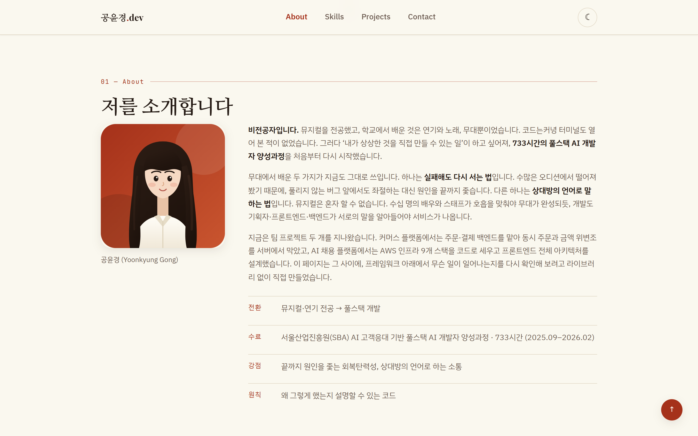

# 나를 소개하는 웹페이지

외부 라이브러리 없이 HTML, CSS, JavaScript 만으로 만든 반응형 포트폴리오
웹사이트입니다. 화면을 그리는 것보다 **사용자 이벤트 → 상태 변경 → 화면 갱신**이
어떻게 이어지는지를 코드로 드러내는 데 중심을 두었습니다.

- 배포 주소: <https://yuuri03.github.io/codyssey/portfolio-website/>
- 개발·확인 환경: Chrome 최신 버전, VS Code + Live Server
- 외부 의존성: 없음 (웹 폰트 Google Fonts 만 사용)

## 목차

1. [프로젝트 개요](#프로젝트-개요)
2. [실행 방법](#실행-방법)
3. [화면](#화면)
4. [파일 구조](#파일-구조)
5. [HTML — 시맨틱 마크업](#html--시맨틱-마크업)
6. [CSS — 레이아웃과 반응형](#css--레이아웃과-반응형)
7. [JavaScript — DOM 과 이벤트](#javascript--dom-과-이벤트)
8. [상태에서 화면으로 이어지는 흐름](#상태에서-화면으로-이어지는-흐름)
9. [GitHub API 연동](#github-api-연동)
10. [폼 유효성 검사](#폼-유효성-검사)
11. [동작 기준값](#동작-기준값)
12. [배포](#배포)

## 프로젝트 개요

브라우저가 직접 이해하는 언어는 HTML, CSS, JavaScript 세 가지뿐이고, React 나
Vue 로 쓴 코드도 결국 이 셋으로 바뀌어 돌아갑니다. 그래서 프레임워크를 배우기
전에 그 아래에서 무슨 일이 일어나는지를 먼저 확인해 보려고 만든 페이지입니다.

페이지는 여섯 섹션으로 이루어집니다.

| 섹션 | 내용 |
| --- | --- |
| Hero | 인사말과 두 개의 CTA 버튼 |
| About | 프로필 이미지와 자기소개 |
| Skills | 실제로 미션에서 써 본 기술만 카드로 정리 |
| Projects | GitHub API 로 불러온 저장소 목록 |
| Contact | 연락처와 문의 폼 |
| Footer | 저작권과 소셜 링크 |

### 사용 기술

| 구분 | 사용한 것 |
| --- | --- |
| 마크업 | HTML5 시맨틱 태그 (`header`, `nav`, `main`, `section`, `article`, `footer`) |
| 스타일 | CSS 변수, Flexbox, Grid, 미디어 쿼리, `transition`, `box-shadow` |
| 스크립트 | ES6+ (화살표 함수, 템플릿 리터럴, 구조분해 할당, `async`/`await`) |
| 브라우저 API | `fetch`, `localStorage`, `IntersectionObserver`, `matchMedia`, `requestAnimationFrame` |
| 외부 데이터 | GitHub REST API (`/users/{id}/repos`) |
| 배포 | GitHub Pages |

## 실행 방법

정적 파일뿐이라 `index.html` 을 브라우저로 바로 열어도 동작하지만, VS Code 의
Live Server 로 여는 것을 권합니다. 파일을 고치면 브라우저가 알아서 새로고침되고,
`file://` 이 아닌 `http://` 로 열리므로 실제 배포 환경과 조건이 같아집니다.

```
1. VS Code 에서 이 폴더(portfolio-website)를 연다.
2. 확장 'Live Server' 를 설치한다.
3. index.html 에서 우클릭 → 'Open with Live Server'
```

터미널만 있다면 파이썬 내장 서버로도 됩니다.

```bash
cd portfolio-website
python -m http.server 8000
```

## 화면

### 데스크톱




### 다크 모드

토글 버튼을 누르면 테마가 바뀌고, 선택은 로컬스토리지에 남아 새로고침 뒤에도
유지됩니다.


### 모바일

768px 아래에서는 메뉴가 사라지고 햄버거 버튼이 나타납니다.

| 기본 화면 | 메뉴를 연 상태 |
| --- | --- |
|  |  |

### 상태별 화면

Projects 섹션은 요청 결과에 따라 네 가지 화면 중 하나를 보여 줍니다.

| 상태 | 화면 |
| --- | --- |
| 성공 |  |
| 에러 |  |

에러 화면은 GitHub 이 403 을 돌려주는 상황을 흉내 내 받아 낸 것입니다.
로딩 중에는 같은 자리에 스피너와 "불러오는 중..." 이 뜨고, 공개 저장소가 하나도
없으면 "표시할 프로젝트가 없습니다" 가 뜹니다.

폼은 빈 값과 형식 오류를 각각 입력 칸 바로 아래에 표시합니다.


## 파일 구조

```
portfolio-website/
├── index.html              페이지 전체 마크업
├── css/
│   └── style.css           디자인 토큰, 레이아웃, 반응형, 다크 모드
├── js/
│   ├── theme.js            다크 모드
│   ├── navigation.js       햄버거 메뉴, 부드러운 스크롤
│   ├── scroll.js           헤더 배경, 맨 위로 버튼, 등장 애니메이션, 현재 섹션
│   ├── projects.js         GitHub API 연동과 상태별 렌더링
│   └── contact-form.js     문의 폼 유효성 검사
├── images/
│   ├── profile.svg         프로필 이미지
│   └── favicon.svg         파비콘
└── README.md
```

스크립트를 역할별로 나눈 이유는 파일 하나가 책임지는 상태가 하나가 되도록
하기 위해서입니다. 다크 모드가 이상하면 `theme.js` 만 보면 되고, 저장소 목록이
안 나오면 `projects.js` 만 보면 됩니다. 파일마다 즉시 실행 함수로 감싸 두어
`const` 이름이 서로 부딪히지 않습니다.

## HTML — 시맨틱 마크업

### 왜 시맨틱 태그를 쓰는가

`div` 는 "여기 상자가 하나 있다" 는 것 말고는 아무것도 알려주지 않습니다.
같은 자리에 `nav` 를 쓰면 브라우저와 스크린 리더, 검색 엔진이 모두 "이건 이 문서의
길잡이다" 라고 읽습니다. 화면에 보이는 모습은 같지만 전달되는 정보가 다릅니다.

실제로 얻는 것이 세 가지 있습니다.

- **보조 기술**: 스크린 리더 사용자는 `main` 으로 건너뛰거나 제목만 훑어 문서를
  탐색합니다. 전부 `div` 면 이 이동이 불가능합니다.
- **검색 엔진**: `header`, `main`, `footer` 의 구분으로 본문이 어디인지 판단합니다.
- **코드를 읽는 사람**: 닫는 태그가 `</div>` 뿐이면 어느 상자가 닫히는지 알 수
  없지만, `</section>` 과 `</footer>` 는 그 자체로 표시가 됩니다.

### 구조를 나눈 기준

"이 덩어리가 무엇인가" 를 한 문장으로 말할 수 있으면 시맨틱 태그를, 말할 수
없고 배치를 위해서만 필요하면 `div` 를 썼습니다.

| 태그 | 쓴 곳 | 이유 |
| --- | --- | --- |
| `header` | 페이지 맨 위 고정 영역 | 문서 전체의 머리말 |
| `nav` | 로고와 메뉴 | 다른 곳으로 가는 링크 묶음 |
| `main` | Hero 부터 Contact 까지 | 이 문서의 본문. 페이지에 하나만 둔다 |
| `section` | 여섯 개 섹션 | 제목을 가진 주제 단위 |
| `article` | Skills 카드, Projects 카드 | 떼어 놓아도 그 자체로 말이 되는 조각 |
| `figure`/`figcaption` | 프로필 이미지와 이름 | 그림과 그 설명의 묶음 |
| `footer` | 저작권과 소셜 링크 | 문서 전체의 꼬리말 |
| `div` | `.about`, `.skills`, `.contact` 등 | 배치를 위한 상자. 의미가 없다 |

Projects 카드에 `article` 을 쓴 것은, 저장소 카드 하나만 떼어 다른 곳에 붙여도
"이런 저장소가 있다" 는 뜻이 그대로 남기 때문입니다. 반대로 카드를 담는
`.projects__grid` 는 격자로 늘어놓기 위한 상자일 뿐이라 `div` 로 두었습니다.

### 그 밖에 지킨 것

- 모든 이미지에 `alt` 를 적었습니다. 장식이 아니라 내용을 전달하는 그림이므로
  "프로필 이미지" 로 끝내지 않고 무엇이 그려져 있는지까지 적었습니다.
- 폼의 `label` 은 `for` 와 입력 칸의 `id` 를 맞췄습니다. 이렇게 하면 글자를 눌러도
  입력 칸에 초점이 가고, 스크린 리더가 칸의 이름을 읽어 줍니다.
- 에러 메시지 자리는 `aria-describedby` 로 입력 칸과 이어 두었습니다.
- 맨 앞에 본문으로 건너뛰는 링크를 두었습니다. 평소에는 화면 밖에 있다가 탭 키로
  초점이 오면 나타납니다.

## CSS — 레이아웃과 반응형

### CSS 변수

색, 간격, 모서리, 그림자를 `:root` 에 모으고, 다크 모드는 `[data-theme="dark"]`
에서 **색 변수만 다시 정의**합니다.

```css
:root {
  --color-bg: #f7f7fb;
  --color-text: #16161d;
  --color-accent: #5b5bd6;
}

[data-theme='dark'] {
  --color-bg: #0d0d14;
  --color-text: #ecedf5;
  --color-accent: #8b8bf0;
}
```

이렇게 두면 다크 모드용 규칙을 따로 쓰지 않아도 됩니다. `background-color:
var(--color-bg)` 한 줄이 두 테마 모두를 처리하므로, 규칙이 두 벌로 갈라져 한쪽만
고치는 실수가 생기지 않습니다.

### Flexbox 와 Grid 를 나눈 기준

둘 다 요소를 늘어놓는 도구지만 다루는 축의 수가 다릅니다.
**Flexbox 는 한 줄(1차원), Grid 는 행과 열(2차원)** 을 다룹니다.
그래서 기준을 이렇게 잡았습니다.

> 내용의 크기에 맞춰 한 방향으로 늘어놓고 남는 공간을 나누는 배치는 Flexbox,
> 칸을 먼저 정하고 그 안에 내용을 넣는 배치는 Grid.

| 대상 | 선택 | 이유 |
| --- | --- | --- |
| 네비게이션 | Flexbox | 로고와 메뉴를 한 줄에 놓고 `justify-content: space-between` 으로 양끝에 민다. 줄은 하나뿐이라 열을 정의할 필요가 없다 |
| Skills 카드 | Grid | 카드 네 개가 화면 너비에 따라 4열 → 2열 → 1열로 바뀐다 |
| Projects 카드 | Grid | 카드 개수를 미리 알 수 없어 열 수를 못 박을 수 없다 |
| 카드 안쪽 | Flexbox | 제목·설명·메타 정보를 세로로 쌓고, 메타를 `margin-top: auto` 로 바닥에 붙인다 |
| About / Contact | Grid | 좁은 화면에서 1열, 768px 이상에서 2열로 바뀌는 두 덩어리 배치 |

Projects 격자에 `auto-fit` 과 `minmax` 를 쓴 이유가 여기서 갈립니다.

```css
.projects__grid {
  display: grid;
  grid-template-columns: repeat(auto-fit, minmax(16rem, 24rem));
  justify-content: start;
}
```

저장소가 몇 개 올지는 API 응답을 받아 봐야 압니다. 열 수를 `3` 처럼 못 박으면
카드가 두 개일 때 빈 칸이 남고, 화면이 좁아지면 카드가 짜부라집니다.
`auto-fit` 은 "칸 하나가 최소 16rem 은 되어야 한다" 는 조건만 주면 몇 열이
들어갈지 브라우저가 계산합니다. 미디어 쿼리 없이도 열 수가 따라 바뀝니다.

위쪽 한계를 `1fr` 이 아니라 `24rem` 으로 잡은 것은, 저장소가 하나뿐일 때
카드가 줄 전체로 늘어나 배너처럼 보였기 때문입니다.

### 모바일 퍼스트와 브레이크포인트

기본 규칙은 좁은 화면 기준으로 쓰고, `min-width` 미디어 쿼리로 넓혀 갑니다.

| 구간 | 폭 | 달라지는 것 |
| --- | --- | --- |
| 모바일 | 기본 | 메뉴가 화면 밖에 있고 햄버거 버튼만 보임. About·Contact 1열 |
| 태블릿 | 768px 이상 | 메뉴가 헤더 안으로 들어오고 햄버거가 사라짐. About·Contact 2열 |
| 데스크톱 | 1024px 이상 | 여백과 글자 크기를 키우고 카드 최소 폭을 18rem 으로 |

`max-width` 로 좁혀 가는 대신 `min-width` 로 넓혀 가는 이유는, 모바일 규칙이
기본값이 되어 덮어쓰는 코드가 줄기 때문입니다. 좁은 화면일수록 기기 성능이
낮은 경우가 많은데, 그쪽이 처리할 규칙이 더 적어지는 이점도 있습니다.

### 시각 효과

- 버튼과 카드에 `:hover` 로 색·위치·그림자를 바꾸고 `transition` 으로 이었습니다.
- 카드에 `box-shadow` 를 주고, 마우스를 올리면 더 진한 그림자로 바꿔 떠오르는
  느낌을 냅니다.
- 움직임을 줄이는 설정(`prefers-reduced-motion`)을 켠 사용자에게는 모든 애니메이션과
  전환을 사실상 끕니다. 움직임에 어지러움을 느끼는 사용자가 있기 때문입니다.

인라인 스타일(`style="..."`)은 쓰지 않았습니다. 모양은 전부 클래스로 바꿉니다.

## JavaScript — DOM 과 이벤트

### 연결 방식

```html
<script defer src="js/theme.js"></script>
```

`defer` 는 HTML 을 읽는 중에 스크립트를 내려받되, **실행은 문서를 다 읽은 뒤로**
미룹니다. 이 속성이 없으면 브라우저가 태그를 만나는 순간 HTML 읽기를 멈추고
스크립트를 실행하는데, 그때는 아직 아래쪽 요소가 만들어지지 않아
`querySelector` 가 `null` 을 돌려줍니다.

예외로 `<head>` 에 짧은 인라인 스크립트를 하나 두었습니다.

```html
<script>
  document.documentElement.dataset.theme = saved || 'light';
</script>
```

테마 적용을 `defer` 스크립트에 맡기면 문서를 다 읽은 뒤에야 어두워지므로,
다크 모드를 쓰는 사람에게 라이트 화면이 한 번 번쩍입니다. 첫 화면이 그려지기
전에 끝나야 하는 이 한 줄만 인라인으로 두었습니다.

### 선택과 연결

```javascript
const toggleButton = document.querySelector('#theme-toggle');

toggleButton.addEventListener('click', () => {
  const nextTheme = root.dataset.theme === 'dark' ? 'light' : 'dark';

  applyTheme(nextTheme);
  writeStored(nextTheme);
});
```

흐름은 언제나 같습니다.

1. `querySelector` (또는 `querySelectorAll`) 로 조작할 요소를 잡는다.
2. `addEventListener` 로 "무슨 일이 일어나면 무엇을 할지" 를 등록한다.
3. 그 일이 실제로 일어나면 등록해 둔 함수가 불린다.

HTML 에 `onclick="..."` 을 적지 않은 이유는 두 가지입니다. 첫째, 화면의 생김새를
적는 곳과 동작을 적는 곳이 섞입니다. 둘째, 한 요소에 여러 개를 붙일 수 없고
나중에 떼어 내기도 어렵습니다. `addEventListener` 는 같은 이벤트에 여러 함수를
붙일 수 있고 `removeEventListener` 로 뗄 수 있습니다.

변수는 `const` 를 기본으로 쓰고, 값이 바뀌는 것만 `let` 으로 두었습니다.
`var` 는 쓰지 않았습니다. `var` 는 블록을 무시하고 함수 전체에서 살아남아,
`if` 나 `for` 안에서 만든 변수가 바깥까지 새어 나가기 때문입니다.

### 다루는 이벤트

| 이벤트 | 쓴 곳 |
| --- | --- |
| `click` | 테마 토글, 햄버거, 앵커 링크, 맨 위로, 다시 시도 |
| `submit` | 문의 폼 제출 |
| `scroll` | 헤더 배경과 맨 위로 버튼 |
| `input` | 폼 입력 중 에러 메시지 갱신 |
| `keydown` | Esc 로 메뉴 닫기 |

### 자주 쓴 ES6+ 문법

**화살표 함수** — 짧은 콜백에서 `function` 키워드와 이름을 생략해 "무엇을 하는지"
만 남깁니다.

```javascript
const formatDate = (isoText) => new Date(isoText).toLocaleDateString('ko-KR');
```

**템플릿 리터럴** — 문자열 사이에 값을 끼워 넣습니다. `+` 로 잇는 것보다
완성된 모습이 그대로 보이고, 줄바꿈을 그대로 쓸 수 있어 HTML 을 만들 때 편합니다.

```javascript
`<span class="card__lang">${escapeHtml(language || 'Text')}</span>`
```

**구조분해 할당** — 객체에서 필요한 값만 꺼내고, 긴 이름은 짧게 바꿔 받습니다.
GitHub 응답에는 수십 개의 항목이 들어 있는데, 쓰는 것만 뽑아 두면 아래 코드에서
`repo.stargazers_count` 대신 `stars` 로 읽을 수 있습니다.

```javascript
const {
  name,
  html_url: url,
  stargazers_count: stars,
} = repo;
```

**배열 메서드** — 반복문 대신 "무엇을 하려는지" 를 이름으로 밝힙니다.

| 메서드 | 쓴 곳 |
| --- | --- |
| `map` | 저장소 객체 배열을 카드 HTML 문자열 배열로 바꾼다 |
| `forEach` | 앵커 링크마다 클릭 리스너를 붙인다 |
| `every` | 모든 입력 칸이 검증을 통과했는지 판정한다 |

`map` 이 특히 중요한 것은, 데이터를 화면으로 바꾸는 일이 곧 "배열을 다른 배열로
바꾸는 일" 이라는 점이 코드에 그대로 드러나기 때문입니다.

```javascript
grid.innerHTML = state.repos.map(createCard).join('');
```

## 상태에서 화면으로 이어지는 흐름

이 페이지에는 같은 모양의 흐름이 세 군데 있습니다.
공통점은 **화면을 바꾸는 코드가 한 곳에만 있다**는 것입니다. 이벤트 처리기는
상태만 바꾸고, 화면 갱신은 그 상태를 읽는 함수 하나가 맡습니다.

### 1. 다크 모드

```
토글 클릭  →  theme = 'dark'  →  <html data-theme="dark">  →  CSS 변수 교체
                                  localStorage 저장
```

상태는 `<html>` 의 `data-theme` 속성 하나뿐입니다. 색을 바꾸는 코드는 자바스크립트에
없고, CSS 가 `[data-theme="dark"]` 를 보고 알아서 바꿉니다. 새로고침 뒤에도
유지되는 것은 값을 로컬스토리지에 남겨 두고 다음 방문 때 다시 읽기 때문입니다.

### 2. Projects 목록

```
페이지 열림 / 다시 시도 클릭
      ↓
state.status = 'loading'   →  render()  →  스피너
      ↓ fetch
성공: state.status = 'success', state.repos = [...]  →  render()  →  카드 목록
실패: state.status = 'error',   state.errorMessage   →  render()  →  안내 + 다시 시도
```

`state` 객체 하나가 지금 무엇이 보이는지를 전부 담고 있고, `render()` 만이 DOM 을
건드립니다. 상태를 바꿀 때는 `setState()` 를 부르는데, 이 함수는 값을 합친 뒤
곧바로 `render()` 를 부릅니다. 그래서 "상태를 바꿨는데 화면을 갱신하는 것을
잊는" 실수가 구조적으로 생기지 않습니다.

```javascript
const setState = (patch) => {
  Object.assign(state, patch);
  render();
};
```

React 가 하는 일도 결국 이것입니다. 상태를 바꾸면 그 상태로 화면을 다시 그리는
함수가 불립니다. 다른 점은 React 가 바뀐 부분만 골라 갱신해 준다는 것이고,
여기서는 `innerHTML` 로 통째로 다시 그립니다.

### 3. 문의 폼

```
제출 클릭  →  preventDefault()  →  칸마다 검증  →  errorMessage 결정
                                                      ↓
                                          renderError() → 메시지 표시/숨김
                                                        → 입력 칸 테두리 색
```

검증 함수는 화면을 건드리지 않고 "무엇이 잘못됐는지" 를 문장으로만 돌려줍니다.
그 문장을 화면에 반영하는 것은 `renderError()` 하나뿐입니다. 덕분에 검증 규칙을
바꿀 때 DOM 코드를 건드릴 일이 없습니다.

## GitHub API 연동

### 요청

```javascript
const loadRepos = async () => {
  setState({ status: 'loading', errorMessage: '' });

  try {
    const response = await fetch(REPOS_URL, {
      headers: { Accept: 'application/vnd.github+json' },
    });

    if (!response.ok) {
      throw new Error(await describeError(response));
    }

    const data = await response.json();

    setState({ status: 'success', repos: data.sort(...) });
  } catch (error) {
    setState({ status: 'error', repos: [], errorMessage: message });
  }
};
```

엔드포인트는 `https://api.github.com/users/yuuri03/repos` 입니다.

`fetch` 는 응답을 기다려야 하므로 결과 대신 약속(Promise)을 돌려줍니다.
`await` 는 그 약속이 끝날 때까지 이 함수 안에서만 기다리게 합니다. 브라우저 전체가
멈추는 것이 아니라서, 기다리는 동안에도 스크롤과 버튼은 그대로 동작합니다.

`.then()` 을 잇는 대신 `async`/`await` 를 쓴 것은 코드가 위에서 아래로 읽히기
때문입니다. 요청하고, 확인하고, 변환하고, 상태를 바꾼다는 순서가 그대로 보입니다.

### 상태별 화면

| 상태 | 조건 | 화면 |
| --- | --- | --- |
| 로딩 | 요청을 보낸 직후 | 스피너와 "불러오는 중..." |
| 성공 | 응답을 받고 저장소가 1개 이상 | 카드 목록 |
| 빈 데이터 | 응답은 받았지만 저장소가 0개 | "표시할 프로젝트가 없습니다" |
| 에러 | 응답이 실패했거나 네트워크가 끊김 | "프로젝트를 불러올 수 없습니다" + 다시 시도 |

`fetch` 는 404 나 403 을 받아도 예외를 던지지 않습니다. 서버가 답을 주긴 준
것이므로 요청 자체는 성공으로 봅니다. 그래서 `response.ok` 를 따로 확인해
직접 예외를 던져야 `catch` 로 넘어갑니다. 반대로 네트워크가 끊긴 경우에는
`fetch` 가 `TypeError` 를 던지므로, 이 둘을 나눠 다른 문장을 보여 줍니다.

### 레이트 리밋

인증 없이 GitHub API 를 부르면 IP 당 시간당 60회까지만 허용됩니다.
한도를 넘기면 403(또는 429)이 돌아옵니다.

```javascript
const remaining = response.headers.get('X-RateLimit-Remaining');
const isRateLimited =
  (response.status === 403 || response.status === 429) &&
  (remaining === '0' || apiMessage.toLowerCase().includes('rate limit'));
```

처음에는 헤더만 보고 판별했는데, 다른 출처에서 온 응답의 헤더는 서버가 노출을
허용한 것만 읽을 수 있어 값이 비는 경우가 있었습니다. 그래서 응답 본문의
`message` 도 함께 확인하도록 고쳤습니다. 한도를 넘긴 경우에는 "시간당 60회까지만
가능하니 잠시 뒤에 다시 시도해 주세요" 라고, 그 외의 실패에는 상태 코드를 붙여
보여 줍니다.

### 받아 온 문자열을 그대로 넣지 않기

저장소 이름과 설명은 API 가 준, 즉 남이 쓴 문자열입니다.
`innerHTML` 에 그대로 넣으면 그 안의 태그가 태그로 해석됩니다.
그래서 화면에 넣기 전에 태그로 읽힐 문자를 바꿔 둡니다.

```javascript
const escapeHtml = (value) =>
  String(value)
    .replaceAll('&', '&amp;')
    .replaceAll('<', '&lt;')
    .replaceAll('>', '&gt;')
    .replaceAll('"', '&quot;')
    .replaceAll("'", '&#39;');
```

## 폼 유효성 검사

`<form>` 에 `novalidate` 를 걸어 브라우저 기본 검증을 껐습니다. 기본 검증은
문구를 바꿀 수 없고 브라우저마다 모양이 달라, 에러를 입력 칸 아래에 한국어로
보여 주려면 직접 처리해야 하기 때문입니다.

| 항목 | 규칙 |
| --- | --- |
| 이름 | 필수, 2자 이상 |
| 이메일 | 필수, `아이디@도메인.최상위` 형식 |
| 메시지 | 필수, 10자 이상 |

```javascript
const EMAIL_PATTERN = /^[^\s@]+@[^\s@]+\.[^\s@]{2,}$/;
```

앞뒤 공백은 `trim()` 으로 지운 뒤 검사하므로 공백만 넣은 제출은 빈 값으로 봅니다.

제출을 처리하는 방식에서 두 가지를 신경 썼습니다.

**하나.** `every` 로 검사하면 첫 실패에서 멈춰 나머지 칸의 에러가 표시되지
않습니다. 그래서 `map` 으로 모든 칸을 검사해 결과를 모은 뒤, 그 결과 배열에
`every` 를 씁니다.

```javascript
const results = fieldNames.map((fieldName) => validateField(fieldName));
const isValid = results.every((passed) => passed);
```

**둘.** 입력하는 동안에는 이미 에러가 떠 있는 칸만 다시 검사합니다. 첫 글자를
치자마자 "2자 이상 입력해 주세요" 가 뜨면 도움이 아니라 방해가 되기 때문입니다.

제출에 성공하면 `event.preventDefault()` 로 페이지 새로고침을 막고 성공 메시지를
띄운 뒤 폼을 비웁니다. 학습용 페이지라 실제로 메일이 전송되지는 않습니다.

## 동작 기준값

기준값은 모두 각 파일 맨 위에 상수로 모아 두었습니다.

| 동작 | 기준값 | 위치 |
| --- | --- | --- |
| 헤더 배경이 나타남 | 스크롤 60px 초과 | `scroll.js` `HEADER_SHIFT_Y` |
| 맨 위로 버튼이 나타남 | 스크롤 300px 초과 | `scroll.js` `SCROLL_TOP_SHOW_Y` |
| 섹션 등장 애니메이션 | `threshold: 0.2` (섹션의 20%가 보이면) | `scroll.js` `REVEAL_THRESHOLD` |
| 현재 섹션 표시 | `rootMargin: -45% 0px -45% 0px` | `scroll.js` |
| 메뉴가 헤더 안으로 들어감 | 768px 이상 | `style.css` 미디어 쿼리 |

스크롤 이벤트는 초당 수십 번 들어오므로, 매번 계산하지 않고
`requestAnimationFrame` 으로 다음 화면 그리기 직전에 한 번만 계산합니다.
계산한 값이 직전과 같으면 DOM 을 아예 건드리지 않습니다.

등장 애니메이션에 `IntersectionObserver` 를 쓴 것도 같은 이유입니다.
스크롤 위치와 각 섹션의 좌표를 직접 비교하면 스크롤할 때마다 계산해야 하지만,
관찰자는 "이 요소가 화면에 20% 들어왔다" 는 순간에만 알려 줍니다.
한 번 나타난 섹션은 `unobserve` 로 관찰을 끊습니다.

## 배포

GitHub Pages 로 `codyssey` 저장소를 통째로 올리고, 이 폴더를 하위 경로로 접근합니다.

```
저장소 Settings → Pages
  Source: Deploy from a branch
  Branch: main / (root)
```

`main` 에 올라간 뒤 1~2분이면 아래 주소에서 열립니다.

<https://yuuri03.github.io/codyssey/portfolio-website/>

미션마다 폴더를 하나씩 두는 저장소 구조를 그대로 쓰기 위해 별도 저장소를 만들지
않았습니다. 다음 미션에서 페이지를 또 만들어도 폴더만 추가하면 됩니다.

경로에 신경 쓸 점이 하나 있습니다. 하위 경로로 배포되므로 `/css/style.css` 처럼
슬래시로 시작하는 절대 경로를 쓰면 저장소 최상단을 가리켜 파일을 찾지 못합니다.
그래서 모든 경로를 `css/style.css`, `images/profile.svg` 처럼 상대 경로로
적었습니다.

## 이번 미션에서 하지 않은 것

선택 과제(프로젝트 언어별 필터링, 타이핑 효과, Formspree 연동, 시스템 다크 모드
감지)는 넣지 않았습니다. 필수 요구사항의 흐름을 분명하게 남기는 쪽에 집중했습니다.

## 저장소

- GitHub: https://github.com/yuuri03/codyssey
- 이 프로젝트는 Codyssey 입학연수 '개발 입문' 미션으로 만들었습니다.
