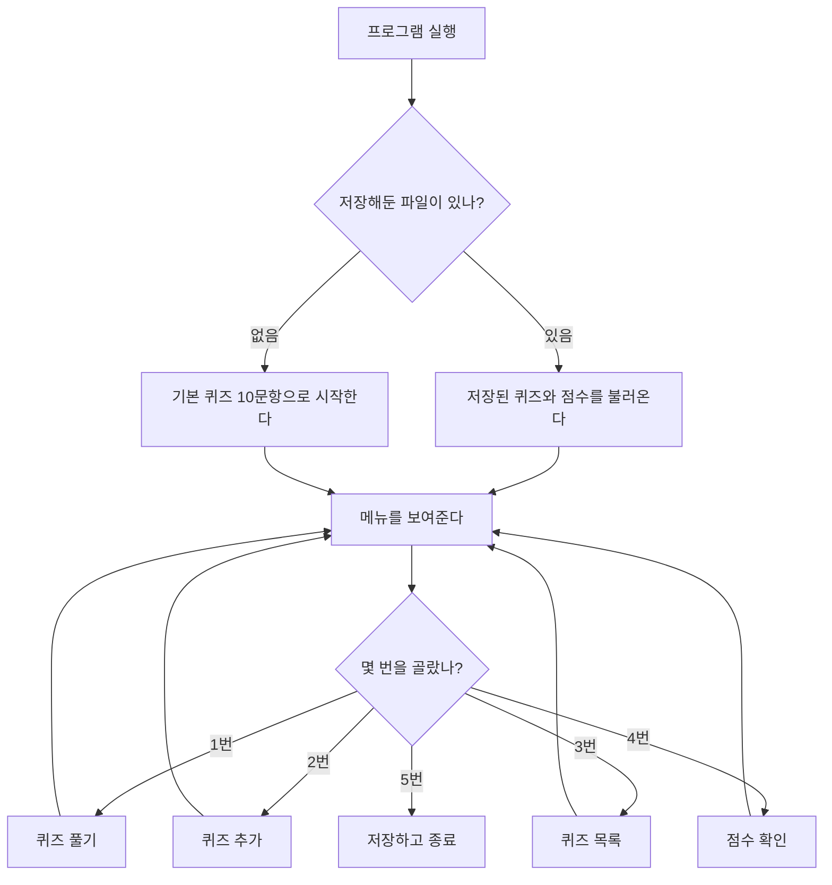
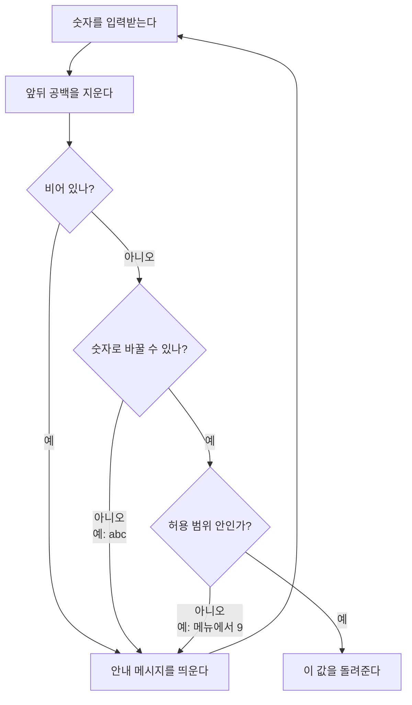
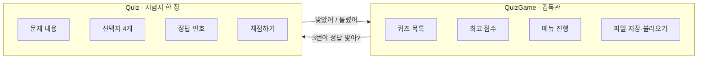
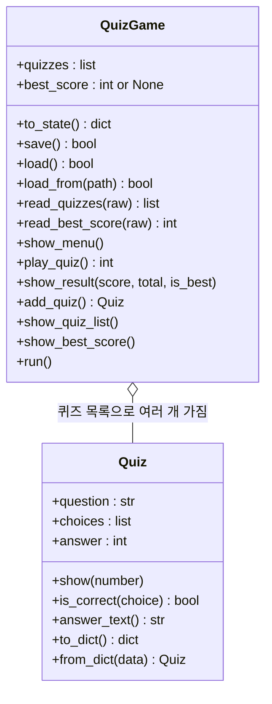
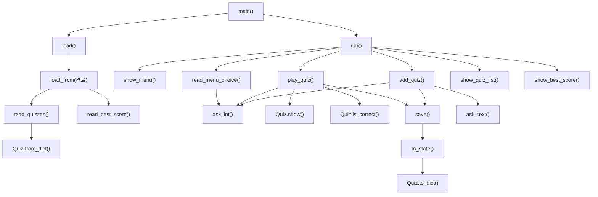
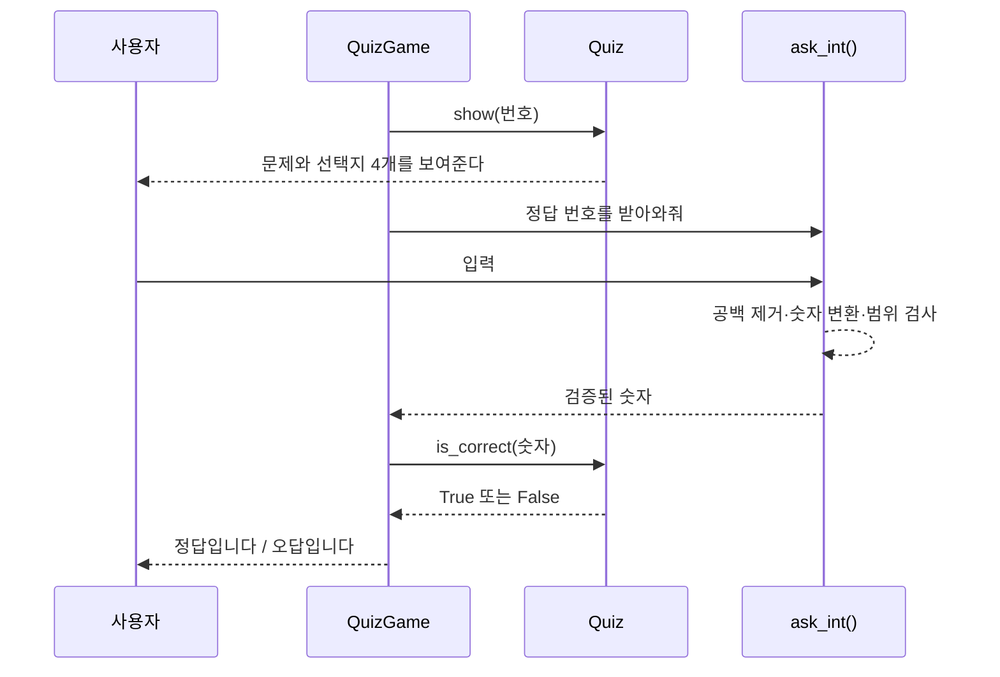
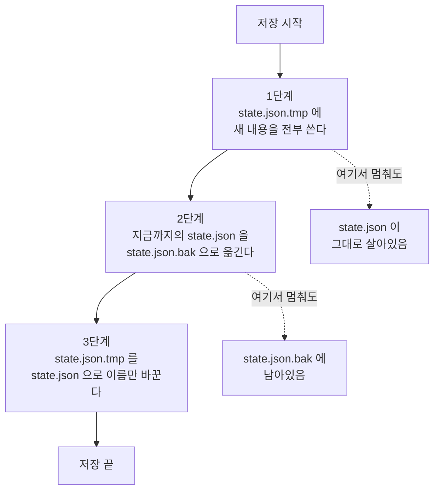
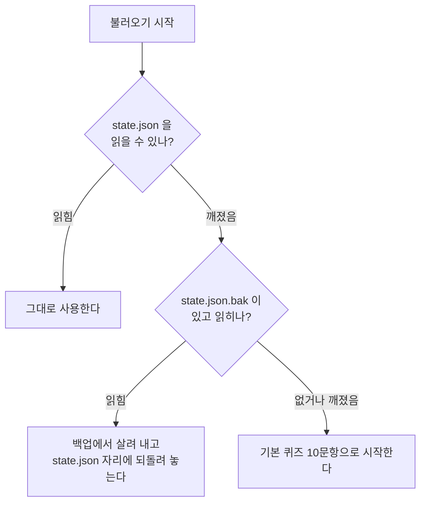
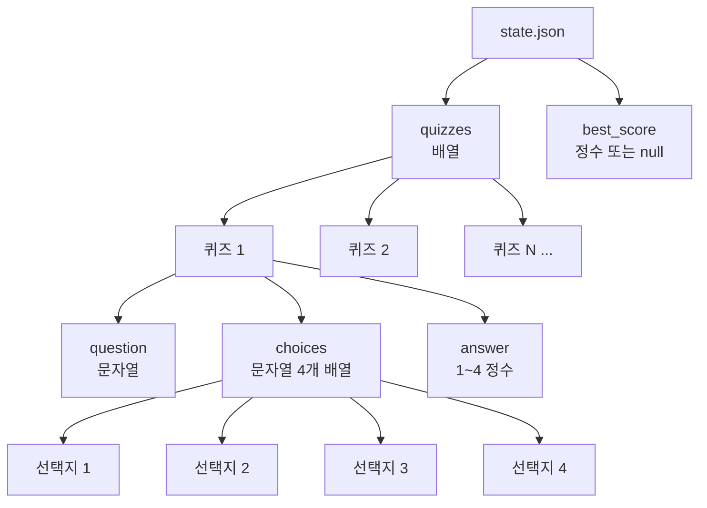
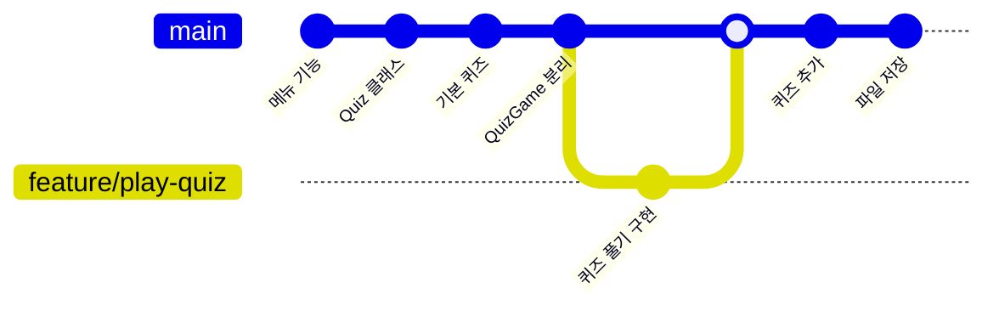

# 뮤지컬 퀴즈 게임

터미널에서 돌아가는 4지선다 퀴즈 게임이에요.
파이썬 기본 문법이랑 클래스, JSON 파일 저장을 익히려고 만들었어요.

## 프로젝트 개요

메뉴에서 번호 골라서 퀴즈 풀고, 문제를 직접 추가하고, 목록이랑 최고 점수를 확인하는
콘솔 프로그램이에요.

외부 라이브러리는 안 썼어요. 표준 라이브러리인 `json` 이랑 `os` 만 써요.
프로그램 껐다 다시 켜도 추가한 퀴즈랑 최고 점수가 남아요.
데이터는 `state.json` 에 UTF-8 로 저장해요.

파이썬은 3.10 이상이면 되고, 저는 3.13 에서 만들고 확인했어요.

### 프로그램이 어떻게 도는지 한눈에

실행하면 저장해둔 게 있는지 먼저 확인하고, 메뉴를 띄운 다음,
고른 번호에 따라 기능을 하나 실행하고 다시 메뉴로 돌아와요.
5번을 고를 때까지 이걸 반복해요.



## 퀴즈 주제와 선정 이유

주제는 뮤지컬이에요.

제가 뮤지컬 전공이라서 골랐어요. 아는 분야라 문제를 직접 쓸 수 있었고,
뭐가 헷갈리는 문제인지도 감이 있었어요.

만들다 보니 4지선다에도 잘 맞는 주제였어요.
작곡가나 원작 소설, 대표 넘버 같은 건 정답이 하나로 딱 떨어지거든요.
오답 선택지도 만들기 편했어요. 앤드루 로이드 웨버 자리에
스티븐 손드하임이나 클로드미셸 쇤베르크를 넣으면 얼추 그럴듯해 보여서
찍어서 맞히기 어려운 문제가 돼요.

기본 문항은 10개고, 게임 안에서 더 추가할 수 있어요.

## 실행 방법

```bash
cd python-quiz-game
python quiz_game.py
```

Windows 에서 `python` 이 안 잡히면 `py quiz_game.py` 로 실행하면 돼요.

첫 실행에는 저장 파일이 없어서 기본 퀴즈 10문항으로 시작해요.

```
[안내] 저장된 데이터가 없습니다.
[안내] 기본 퀴즈로 시작합니다.
```

두 번째 실행부터는 저장된 내용을 불러와요.

```
[알림] 저장된 데이터를 불러왔습니다. (퀴즈 11개, 최고 기록 11문제 정답)
```

## 기능 목록

메뉴에서 번호를 입력해서 골라요.

1. **퀴즈 풀기** — 등록된 퀴즈를 순서대로 내고 바로 정답인지 알려줘요.
   다 풀면 맞힌 개수랑 정답률을 보여주고, 최고 점수를 넘었으면 그것도 알려줘요.
2. **퀴즈 추가** — 문제랑 선택지 4개, 정답 번호를 입력받아서 등록하고 바로 저장해요.
3. **퀴즈 목록** — 등록된 문항을 번호랑 같이 한 줄씩 보여줘요.
4. **점수 확인** — 지금까지 최고 기록을 보여줘요. 아직 안 풀었으면 그렇게 알려줘요.
5. **종료** — 현재 상태를 저장하고 끝내요.

### 잘못된 입력 처리

숫자를 받는 자리는 전부 같은 함수를 거치게 만들어서, 아래 경우에 안내를 띄우고
다시 입력받아요.

제대로 된 값이 들어올 때까지 계속 되물어요. 몇 번을 잘못 쳐도 프로그램이 안 죽어요.




- 앞뒤 공백은 지워요. `  4  ` 도 4로 받아요.
- 그냥 Enter 친 빈 입력
- `abc` 처럼 숫자로 못 바꾸는 값
- 범위 밖 숫자. 메뉴에서 `9`, 정답 번호로 `0` 같은 경우

이런 상황에서도 프로그램이 안 죽게 했어요.

- Ctrl+C 를 누르거나 입력이 끊기면, 파이썬 오류를 그대로 띄우지 않고
  안내를 출력한 다음 지금까지 내용을 저장하고 종료해요.
- 저장 파일이 없으면 기본 퀴즈로 시작해요.
- 저장 파일이 깨져서 JSON 으로 못 읽으면 백업 파일로 한 번 더 시도하고,
  그것도 안 되면 안내하고 기본 퀴즈로 시작해요.
- 문항 하나만 형식이 틀린 경우엔 그 문항만 건너뛰고 나머지는 그대로 불러와요.
- 파일 읽기나 쓰기에서 오류가 나도 안내만 하고 게임은 계속 돌아가요.

복구는 아래 순서로 해요. 위에서 되면 아래는 안 해요.
살릴 수 있는 걸 최대한 살리고, 정말 안 될 때만 처음 상태로 돌아가는 순서예요.

| 순위 | 상황 | 하는 일 |
|---|---|---|
| 1 | 문항 하나가 깨짐 | 그 문항만 버리고 나머지는 살려요 |
| 2 | `state.json` 전체가 깨짐 | `state.json.bak` 에서 읽어요 |
| 3 | 백업도 깨짐 | 기본 퀴즈 10문항으로 시작해요 |
| 4 | 저장 실패 | 안내만 하고 게임은 계속 돌려요. 다음 저장 때 다시 시도해요 |

로그 파일은 안 만들어요. 콘솔 프로그램이라 `[안내]` / `[알림]` 을 화면에 바로
띄우는 걸로 충분하다고 봤어요. `[안내]` 는 뭔가 잘 안 된 상황이고,
`[알림]` 은 정상적으로 일어난 일이에요.

## 파일 구조

저장소는 미션별 폴더로 나뉘어 있고, 이 미션은 `python-quiz-game/` 폴더예요.

```
codyssey/
├── .gitignore               저장소 공통. state.json 같은 걸 제외해요
├── README.md                저장소 전체 안내
├── python-quiz-game/        이 미션
│   ├── quiz_game.py         프로그램 전체
│   ├── state.json           퀴즈랑 최고 점수 저장 파일. 실행하면 생기고 git 엔 안 올라가요
│   ├── state.json.bak       직전 저장 내용 백업. 저장할 때 자동으로 생겨요
│   └── README.md            이 문서
└── mini-npu-simulator/      다른 미션
```

`quiz_game.py` 안은 이렇게 나눠 놨어요.

- 상수 — `TITLE`, `MENU_ITEMS`, `CHOICE_COUNT`, `STATE_FILE`, `BACKUP_FILE`,
  `TEMP_FILE`, `DEFAULT_QUIZ_DATA`
- `Quiz` 클래스 — 문제 한 개를 담아요. 값 검증, 화면 출력, 채점, JSON 변환을 해요.
- `QuizGame` 클래스 — 퀴즈 목록이랑 최고 점수를 들고 메뉴 진행, 저장, 불러오기를 해요.
- 입력 헬퍼 — `ask_int()`, `ask_text()`, `read_menu_choice()`
- 그 외 — `default_quizzes()`, `main()`, `finish_early()`

### 두 클래스가 각각 맡는 일

비유하자면 `Quiz` 는 **시험지 한 장**이고, `QuizGame` 은 **시험을 진행하는 감독관**이에요.
시험지는 자기 정답만 알고 있고, 감독관은 시험지를 몇 장 갖고 있는지와
지금까지 최고 점수가 얼마인지를 알아요.

감독관이 시험지의 정답을 직접 훔쳐보지 않고 "이거 맞았어?" 하고 물어보는 게 핵심이에요.



| `Quiz` (문제 한 개) | `QuizGame` (게임 전체) |
|---|---|
| `__init__()` 값 검증 | `__init__()` 기본 퀴즈로 시작 |
| `show()` 문제와 선택지 출력 | `show_menu()` 메뉴 출력 |
| `is_correct()` 채점 | `play_quiz()` 출제·채점 진행 |
| `answer_text()` 정답 내용 | `add_quiz()` 새 문제 등록 |
| `to_dict()` / `from_dict()` JSON 변환 | `show_quiz_list()` 목록 보기 |
| `__str__()` 한 줄 표시 | `show_best_score()` 점수 확인 |
| | `save()` / `load()` / `load_from()` 파일 입출력 |
| | `read_quizzes()` / `read_best_score()` 읽은 값 검사 |
| | `run()` 메뉴 반복 |

코드에 있는 속성과 메서드를 그대로 옮기면 이렇게 돼요.



경계를 나눈 기준은 **"이 정보를 누가 알고 있어야 하나"** 예요.
정답이 몇 번인지는 문제 한 개만 알면 되니까 `Quiz` 가 갖고,
최고 점수는 게임 전체가 알아야 하니까 `QuizGame` 이 가져요.
그래서 `QuizGame` 은 `quiz.answer` 를 직접 꺼내 비교하지 않고
`quiz.is_correct(번호)` 를 불러요. 정답 판정 규칙이 바뀌어도
`Quiz` 안에서만 고치면 되게요.

### 호출 흐름

어떤 함수가 어떤 함수를 부르는지 전부 그리면 이래요.



`ask_int()` 로 화살표가 **세 군데에서** 들어오는 게 보이죠.
메뉴 번호, 정답 번호, 퀴즈 추가할 때 정답 번호요.
숫자를 받는 자리는 전부 이 함수 하나를 거쳐요.

`main()` 이 `QuizGame` 을 만들고 `load()` 로 저장 파일을 읽은 다음 `run()` 을 불러요.
`run()` 은 `show_menu()` 로 메뉴를 띄우고 `read_menu_choice()` 로 번호를 받아서
해당 메서드로 보내요. 번호를 받는 자리는 전부 `ask_int()` 를 거치기 때문에,
잘못된 입력은 메뉴든 정답 번호든 같은 자리에서 걸러져요.
`ask_int()` 는 올바른 값을 받을 때까지 안 돌아오니까, 부르는 쪽은
"여기서 받은 값은 이미 검증된 값" 이라고 믿고 쓸 수 있어요.

문제 하나를 채점하는 동안 누가 누구에게 뭘 시키는지 순서대로 보면 이래요.



`QuizGame` 이 정답을 직접 안 보고 `Quiz` 에게 물어보는 게 여기서 드러나요.

퀴즈를 다 풀면 `play_quiz()` 가 최고 점수를 갱신하고 `save()` 를 부르고,
`save()` 는 `to_state()` 로 만든 딕셔너리를 파일에 써요.
그러니까 화면 출력 → 입력 검증 → 게임 진행 → 저장이 한 방향으로만 흘러요.
저장 쪽에서 화면을 부르거나 입력을 받는 일은 없어요.

### 왜 함수 말고 클래스로 했나

문제 하나를 `{"question": ..., "choices": [...], "answer": 2}` 같은 딕셔너리로만
들고 다녔어도 돌아가긴 해요. 그런데 그러면 값이 올바른지 확인하는 코드를
퀴즈를 만드는 자리마다 반복해서 써야 해요. 기본 퀴즈 만들 때 한 번,
사용자가 추가할 때 한 번, 파일에서 읽을 때 또 한 번요.

`Quiz.__init__()` 에 검증을 넣으니까 이게 한 군데로 모였어요.
`Quiz` 가 만들어졌다는 건 곧 "선택지 4개가 다 채워져 있고 서로 다르고
정답 번호가 1~4 안에 있다" 는 뜻이라서, 그 뒤 코드에서는 다시 확인 안 해도 돼요.
실제로 `70dde5f` 커밋에서 "선택지가 서로 중복되면 안 된다" 는 규칙을 나중에
추가했는데, `Quiz.__init__()` 한 곳만 고치니까 세 경로에 전부 적용됐어요.

테스트할 때도 편해요. `Quiz("문제", ["가","나","다","라"], 2).is_correct(2)` 처럼
게임을 실행하지 않고 문제 하나만 떼서 확인할 수 있어요.
게임 로직이랑 섞여 있었으면 채점 하나 확인하려고 메뉴부터 거쳐야 했을 거예요.

`STATE_FILE` 은 `__file__` 을 기준으로 경로를 만들어요.
그래서 어느 폴더에서 실행하든 항상 `quiz_game.py` 옆의 `state.json` 을 써요.

## 데이터 파일 설명 (state.json)

- 경로는 `python-quiz-game/state.json` 이에요. `quiz_game.py` 랑 같은 자리예요.
- 인코딩은 UTF-8 이에요. `ensure_ascii=False` 를 줘서 한글이 그대로 보이게 저장해요.
- 퀴즈 목록이랑 최고 점수를 담아요. 이게 있어서 껐다 켜도 내용이 남아요.
- 첫 실행엔 없어요. 퀴즈를 추가하거나, 최고 점수가 바뀌거나, 종료할 때 만들어져요.
- `.gitignore` 에 넣어서 저장소엔 안 올려요. 사람마다 추가한 문제랑 점수가 다르니까
  소스가 아니라 실행 결과물이라고 봤어요.

### 언제 저장되나

파일을 덮어쓰는 시점은 네 군데예요. 매번 파일 전체를 새로 써요.

| 시점 | 부르는 곳 | 저장되는 내용 |
|---|---|---|
| 퀴즈를 추가했을 때 | `add_quiz()` | 새 문제가 들어간 퀴즈 목록 |
| 최고 점수를 넘겼을 때 | `play_quiz()` | 갱신된 `best_score` |
| 메뉴에서 5번(종료) | `run()` | 현재 상태 전부 |
| Ctrl+C 나 입력 끊김 | `finish_early()` | 그때까지의 상태 |

최고 점수를 못 넘긴 회차는 저장 안 해요. 바뀐 게 없으니까요.

### 왜 JSON 으로 저장했나

저장할 게 `{퀴즈 목록, 최고 점수}` 정도라서 형식을 고를 여지가 있었어요.
후보를 셋 놓고 비교했어요.

| 형식 | 장점 | 단점 |
|---|---|---|
| JSON | 표준 라이브러리로 되고, 메모장으로 열어서 눈으로 확인돼요 | 파일이 텍스트라 바이너리보다 조금 커요 |
| pickle | 파이썬 객체를 그대로 저장해요 | 열어봐도 못 읽고, 남이 만든 파일을 읽으면 위험해요 |
| CSV | 더 가벼워요 | 선택지 4개가 한 칸 안에 들어가야 해서 구조가 안 맞아요 |

JSON 을 골랐어요. 이유는 세 가지예요.

첫째, `import json` 만 하면 돼요. 미션 조건이 외부 라이브러리 없이 만드는 거라
표준 라이브러리로 되는 게 중요했어요.

둘째, 퀴즈처럼 **중첩된 구조**에 맞아요. 문제 하나가 문자열 하나랑 목록 하나랑
숫자 하나를 갖는 모양인데, CSV 는 한 줄에 칸을 나열하는 방식이라 목록을 넣기가
어색해요. JSON 은 딕셔너리와 배열이 그대로 들어가요.

셋째, 저장 파일을 **직접 열어볼 수 있어요**. 퀴즈가 잘 저장됐는지 확인할 때
파일을 열어서 바로 보면 되고, 오타가 있으면 손으로 고칠 수도 있어요.
pickle 은 바이너리라 열어도 못 읽어요. 크기는 퀴즈 10개에 2KB 정도라
텍스트라서 커진다는 단점이 문제될 규모가 아니었어요.

### 저장 파일이 깨지지 않게 하는 방법

`state.json` 을 바로 열어서 쓰면 위험한 순간이 생겨요.
파일을 여는 순간 기존 내용이 비워지는데, 다 쓰기 전에 프로그램이 멈추면
반쯤 쓰인 파일만 남고 이전 내용까지 같이 날아가요.

그래서 저장을 세 단계로 해요.

1. `state.json.tmp` 에 먼저 전부 써요. 이 동안 `state.json` 은 그대로 있어요.
2. 기존 `state.json` 을 `state.json.bak` 으로 옮겨요.
3. `state.json.tmp` 를 `state.json` 이름으로 바꿔 끼워요.

2번과 3번은 `os.replace()` 를 써요. 이름만 바꾸는 거라 중간에 끊길 틈이 거의 없어요.
어느 단계에서 멈추더라도 온전한 파일이 최소 하나는 남아요.

**원고를 고쳐 쓰는 것에 비유하면** 이래요. 원본에 바로 덧칠하면 고치다 만 상태로
망가지지만, 새 종이에 다 옮겨 적은 다음 원본을 서랍에 넣고 새 종이를 그 자리에 두면
어느 순간에 멈춰도 읽을 수 있는 원고가 남아요.



백업은 **한 세대만** 보관해요. 직전 저장 내용 하나요.
주기적 백업이나 여러 세대 보관은 안 해요. 퀴즈 게임이라 잃어버려도
문제 몇 개랑 점수 정도고, 파일이 계속 쌓이면 오히려 관리가 번거로워서요.

불러올 때는 `state.json` 을 먼저 읽고, 그게 깨져 있으면 `state.json.bak` 을 읽어요.
백업에서 살려 냈으면 그 내용을 다시 `state.json` 자리에 써 놔요.



```
[안내] 저장 파일이 손상되어 읽을 수 없습니다.
[안내] 백업 파일로 다시 시도합니다.
[알림] 저장된 데이터를 불러왔습니다. (퀴즈 10개, 최고 기록 7문제 정답)
```

둘 다 깨졌으면 기본 퀴즈 10문항으로 시작해요.
두 파일 다 `.gitignore` 에 넣어서 저장소엔 안 올라가요.

### 필드 구조

저장 파일이 어떻게 생겼는지 그림으로 보면 이래요.
`quizzes` 안에 퀴즈가 여러 개 들어가고, 퀴즈 하나가 다시 세 개로 나뉘는 **중첩 구조**예요.



| 키 | 타입 | 설명 |
|---|---|---|
| `quizzes` | 배열 | 퀴즈 목록 |
| `quizzes[].question` | 문자열 | 문제 내용. 빈 값은 안 돼요 |
| `quizzes[].choices` | 문자열 배열 | 선택지 4개. 빈 값이나 중복은 안 돼요 |
| `quizzes[].answer` | 정수 | 정답 번호 1~4 |
| `best_score` | 정수 또는 `null` | 최고로 맞힌 문제 수. 아직 안 풀었으면 `null` |

`best_score` 를 0 이 아니라 `null` 로 둔 이유가 있어요.
아직 한 번도 안 풀어본 상태랑, 풀었는데 한 문제도 못 맞힌 0점은 다른 상태거든요.
둘 다 0으로 두면 점수 확인 화면에서 구분이 안 돼서 `null` 로 나눴어요.

```json
{
  "quizzes": [
    {
      "question": "뮤지컬 「오페라의 유령」의 음악을 작곡한 인물은?",
      "choices": ["스티븐 손드하임", "앤드루 로이드 웨버", "클로드미셸 쇤베르크", "프랭크 와일드혼"],
      "answer": 2
    }
  ],
  "best_score": 9
}
```

저장 파일을 지우면 기본 10문항 상태로 돌아가요.

### 필드가 바뀌면

지금은 저장 파일에 형식 번호를 안 적어 놨어요. 필드가 하나뿐인 구조라
번호를 붙일 만큼 복잡하지 않았거든요.

나중에 필드를 늘려야 하면 두 가지 경우로 나뉘어요.

**필드를 더하기만 할 때**는 지금 코드로도 그냥 돼요.
`read_quizzes()` 가 `question`, `choices`, `answer` 세 개만 확인하고
나머지 키는 무시하거든요. 예를 들어 힌트를 넣는다고 `hint` 를 추가해도,
힌트가 없는 옛날 파일은 `data.get("hint")` 가 `None` 이 될 뿐 안 깨져요.

**필드 이름을 바꾸거나 없앨 때**는 옛날 파일을 못 읽게 돼요.
그때는 저장 파일에 `"version": 2` 같은 키를 넣고,
`load_from()` 에서 번호를 보고 옛날 형식이면 새 형식으로 바꿔 읽는 함수를
한 번 거치게 만들면 돼요. 지금은 그 단계가 필요할 만큼 구조가 안 복잡해서
안 넣었어요.

## 퀴즈가 많아지면

지금 구조는 퀴즈를 전부 메모리에 올려놓고, 저장할 때마다 파일 전체를 다시 써요.
문항이 많아지면 어디서부터 문제가 되는지 직접 재봤어요.

```
    10개  파일      2.4KB  저장    1.18ms  불러오기    0.18ms
   100개  파일     24.2KB  저장    2.32ms  불러오기    0.42ms
  1000개  파일    246.6KB  저장   10.37ms  불러오기    5.81ms
 10000개  파일   2514.2KB  저장  115.54ms  불러오기   47.14ms
```

문항 수에 거의 정비례해요. 문항이 10배가 되면 시간도 10배쯤 돼요.
파일 전체를 매번 새로 쓰고 매번 통째로 읽으니까 당연한 결과예요.

**1000개까지는 괜찮아요.** 저장이 10ms 라 문제 하나 추가하고 저장할 때
사람이 느끼지 못해요. 메모리도 250KB 정도라 신경 쓸 수준이 아니에요.

**문제가 되는 건 속도보다 화면이에요.** 1000개면 `3. 퀴즈 목록` 을 골랐을 때
1000줄이 한 번에 쏟아져서 위쪽은 스크롤로 사라져요. `1. 퀴즈 풀기` 는
1000문제를 전부 내니까 끝까지 풀 수가 없고요. 이건 저장 방식과 상관없이
지금 구현이 "전부 보여주고 전부 출제한다" 라서 생기는 한계예요.

**10000개부터는 저장도 느껴져요.** 115ms 면 문제 하나 추가할 때마다
멈칫하는 게 보여요. 파일도 2.5MB 라 백업까지 5MB 예요.

그래서 늘린다면 순서를 이렇게 잡을 것 같아요.

| 문항 수 | 손볼 것 |
|---|---|
| ~1000개 | 목록을 20개씩 끊어서 보여주기, 풀 문제 수 고르기 |
| ~10000개 | 문제 추가할 때 파일 전체 대신 바뀐 부분만 쓰기 |
| 그 이상 | JSON 대신 SQLite 로 옮기기. 필요한 문항만 읽고 검색도 맡기기 |

검색 기능을 붙인다면 지금은 목록을 처음부터 끝까지 훑는 수밖에 없어요.
문제 내용을 키로 하는 딕셔너리를 하나 더 들고 있으면 훑지 않고 바로 찾을 수 있는데,
1000개 훑는 데 1ms 도 안 걸려서 지금 넣으면 관리할 게 늘기만 해요.

## 뭘 바꾸고 싶을 때 어디를 고치면 되나

고칠 일이 생겼을 때 찾아가야 하는 자리를 적어 뒀어요. 전부 `quiz_game.py` 안이에요.

| 바꾸고 싶은 것 | 고칠 자리 |
|---|---|
| 점수 계산 방식 (예: 정답률 대신 100점 만점) | `play_quiz()` 의 `score += 1`, `show_result()` 의 `percent` |
| 최고 점수를 무엇으로 볼지 | `play_quiz()` 의 `is_best` 판단 줄 |
| 선택지 개수 (4개 → 5개) | 상수 `CHOICE_COUNT`. 검증·입력·출제가 전부 이 값을 봐요 |
| 문제에 붙는 정보 (힌트, 난이도 등) | `Quiz.__init__()`, `to_dict()`, `from_dict()` 세 곳 |
| 문제·선택지 검증 규칙 | `Quiz.__init__()` 한 곳 |
| 메뉴 항목 추가·삭제 | 상수 `MENU_ITEMS` 와 `QuizGame.run()` 의 분기 |
| 기본 퀴즈 내용 | 상수 `DEFAULT_QUIZ_DATA` |
| 저장 파일 위치·이름 | 상수 `STATE_FILE`, `BACKUP_FILE`, `TEMP_FILE` |
| 저장 형식 (JSON → 다른 것) | `save()`, `load_from()`, `to_state()` |
| 잘못된 입력 안내 문구 | `ask_int()`, `ask_text()` |

점수랑 문제 구조가 서로 다른 자리에 있는 게 중요해요.
점수 규칙을 바꿔도 `Quiz` 는 안 건드리고, 문제에 힌트를 붙여도
`play_quiz()` 의 채점 부분은 그대로예요.

## Git 작업 기록

### 커밋

저장소 전체에 커밋이 28개 있고, 그중 이 미션에 해당하는 게 25개예요.
기능 하나를 끝낼 때마다 하나씩 커밋했어요.

```
58ed990 Chore: 저장소 초기화 및 .gitignore, README 뼈대 추가
8a9180a Feat: 메뉴 출력 및 종료 기능 구현
3b493d9 Refactor: 숫자 입력 검증을 공통 헬퍼 ask_int() 로 분리
ac17f12 Feat: Quiz 클래스 구현 (문제, 선택지 4개, 정답 번호 관리)
58bc872 Feat: 파이썬 기초 주제 기본 퀴즈 8문항 추가
019e655 Refactor: 게임 진행 로직을 QuizGame 클래스로 이동
b169463 Feat: 퀴즈 풀기 기능 구현 (출제, 채점, 결과 표시)
0c3d39d Merge: feature/play-quiz 브랜치의 퀴즈 풀기 기능을 main 에 병합
a46ac87 Feat: 퀴즈 주제를 뮤지컬로 교체하고 기본 문항 10개 작성
85695a3 Feat: 퀴즈 추가 기능 구현
12e210d Feat: 퀴즈 목록 기능 구현
0f7cb7c Feat: 최고 점수 확인 및 갱신 기능 구현
a690f9b Feat: state.json 파일 저장/불러오기 구현 (데이터 영속성)
71b0408 Feat: Ctrl+C / 입력 종료 시 안전하게 저장하고 종료하도록 처리
1a4e197 Chore: 개발 도구 생성 폴더(.omc)를 git 추적에서 제외
f1b841b Docs: README 전체 작성 (개요, 주제 선정 이유, 실행 방법, 기능, 구조, 데이터 파일)
8964850 Docs: README 에 저장소 링크와 미션 출처 안내 추가
70dde5f Fix: 선택지가 서로 중복되면 퀴즈 생성을 거부하도록 검증 추가
```

직접 확인하려면 이렇게 하면 돼요.

```bash
git log --oneline            # 전체 목록
git rev-list --count HEAD    # 커밋 개수
```

### 커밋 메시지 규칙

`말머리: 한 줄 요약` 형태로 적었어요. 말머리는 다섯 가지만 써요.

| 말머리 | 언제 | 예 |
|---|---|---|
| `Feat` | 기능을 새로 만들었을 때 | `Feat: 퀴즈 목록 기능 구현` |
| `Fix` | 잘못 동작하던 걸 고쳤을 때 | `Fix: 폴더 정리 때 루트에 남은 quiz_game.py 삭제` |
| `Refactor` | 동작은 그대로고 구조만 바꿨을 때 | `Refactor: 게임 진행 로직을 QuizGame 클래스로 이동` |
| `Docs` | 문서만 고쳤을 때 | `Docs: README 실행 방법 추가` |
| `Chore` | 설정이나 정리 작업 | `Chore: 미션별 폴더로 저장소 구조 정리` |

요약 줄에는 **뭘 했는지**를 적고, 왜 했는지는 본문에 적어요.
본문이 필요하면 빈 줄을 하나 두고 `-` 로 나열해요.

```
Chore: 개인 학습 메모를 이름 패턴으로 커밋 대상에서 제외

- 저장소 루트를 정리하면서 노트 파일 위치가 바뀌어 기존 경로 규칙이 맞지 않게 되었다
- 폴더와 무관하게 걸리도록 *공부노트.md / *설명노트.md 패턴으로 바꾼다
```

커밋 하나에 기능 하나만 담으려고 했어요. `수정`, `update` 처럼
나중에 봐서 뭘 했는지 모르는 메시지는 안 썼어요.

### 브랜치와 병합

`퀴즈 풀기` 기능은 `feature/play-quiz` 브랜치를 따로 만들어서 작업하고 `main` 에 병합했어요.

```
*   0c3d39d Merge: feature/play-quiz 브랜치의 퀴즈 풀기 기능을 main 에 병합
|\
| * b169463 Feat: 퀴즈 풀기 기능 구현 (출제, 채점, 결과 표시)
|/
* 019e655 Refactor: 게임 진행 로직을 QuizGame 클래스로 이동
```

```bash
git log --oneline --graph --all    # 위 그래프 확인
git branch -a                      # main, feature/play-quiz
```

같은 내용을 그림으로 보면 이래요. 가운데 줄이 `main` 이고,
아래로 갈라진 줄이 `feature/play-quiz` 예요.
갈라져 나가서 따로 작업한 다음 다시 합쳐진 모양이에요.



**공사 중인 방을 따로 두는 것**에 비유하면 쉬워요.
집 전체를 쓰면서 거실을 뜯어고치면 그동안 아무도 거실을 못 써요.
방 하나를 따로 빌려서 거기서 다 만든 다음 통째로 옮겨오면,
만드는 동안에도 집은 멀쩡하게 돌아가요.
`main` 이 집이고 `feature/play-quiz` 가 따로 빌린 방이에요.

브랜치를 왜 쓰는지 만들면서 알게 된 게 있어요.

**만들다 만 코드가 main 에 안 들어가요.** 퀴즈 풀기를 만드는 중간에는
채점이 반만 돌아가는 상태였는데, 그 상태가 main 에 있으면
main 을 받은 사람은 고장난 프로그램을 받게 돼요.
브랜치에서 다 만들고 병합하면 main 은 항상 돌아가는 상태로 유지돼요.

**되돌리기가 쉬워요.** 기능 하나가 통째로 브랜치에 담겨 있으면
"이 기능 빼자" 가 될 때 병합 커밋 하나만 되돌리면 돼요.
커밋이 main 에 섞여 있으면 어디부터 어디까지가 그 기능인지 찾아야 해요.

**여럿이 일할 때 필수예요.** 지금은 혼자라 브랜치 없이도 되지만,
두 사람이 같은 파일을 동시에 고치면 브랜치가 없으면 서로 덮어써요.
브랜치를 나누면 각자 자기 자리에서 만들고, 합칠 때 한 번만 충돌을 정리하면 돼요.
`--no-ff` 로 병합하면 위 그래프처럼 갈라졌다 합쳐진 모양이 남아서
나중에 어떤 기능이 언제 들어왔는지 보여요.

작업 흐름은 이랬어요.

```bash
git checkout -b feature/play-quiz   # 브랜치 만들고 이동
# 기능 구현하고 커밋
git checkout main                   # main 으로 돌아오기
git merge feature/play-quiz         # 병합
```

### clone 과 pull 실습

원격 저장소를 다른 폴더에 복제해서, 거기서 고친 내용을 원래 폴더로 받아오는
과정을 해봤어요.

**1) 별도 폴더에 clone**

```bash
git clone https://github.com/yuuri03/codyssey.git codyssey-clone
```
```
Cloning into 'codyssey-clone'...
```

**2) 복제한 쪽에서 README 한 줄 고치고 commit → push**

```bash
git add README.md
git commit -m "Docs: 공통 사항에 커밋과 브랜치 작업 방식을 한 줄 추가"
git push origin main
```
```
[main da3ef63] Docs: 공통 사항에 커밋과 브랜치 작업 방식을 한 줄 추가
 1 file changed, 1 insertion(+)
To https://github.com/yuuri03/codyssey.git
   6b382a2..da3ef63  main -> main
```

**3) 원래 작업 폴더에서 pull**

```bash
git pull origin main
```
```
From https://github.com/yuuri03/codyssey
 * branch            main       -> FETCH_HEAD
   6b382a2..da3ef63  main       -> origin/main
Updating 6b382a2..da3ef63
Fast-forward
 README.md | 1 +
 1 file changed, 1 insertion(+)
```

**4) 반영 확인**

```bash
git log --oneline -2
```
```
da3ef63 Docs: 공통 사항에 커밋과 브랜치 작업 방식을 한 줄 추가
6b382a2 Docs: README 말투 수정
```

`clone` 은 원격 저장소를 통째로 복제해서 새 폴더를 만드는 거고,
`pull` 은 이미 있는 폴더에 원격의 변경분만 받아오는 거예요.
그래서 처음 받을 때만 `clone` 을 쓰고, 그다음부터는 `pull` 을 써요.

### 쓴 명령어

미션에서 요구한 기본 명령어 7종을 전부 썼어요.

| 명령어 | 쓴 곳 |
|---|---|
| `init` | 저장소를 처음 만들 때 (`58ed990`) |
| `add` | 커밋마다 |
| `commit` | 28회 |
| `push` | 커밋 후 원격에 올릴 때마다 |
| `pull` | 위 실습 3단계, 그리고 원격 초기 커밋을 받아올 때 (`b2d851a`) |
| `checkout` | `feature/play-quiz` 만들고 오갈 때 |
| `clone` | 위 실습 1단계 |

## 저장소

- GitHub: https://github.com/yuuri03/codyssey
- Codyssey 입학연수 '개발 입문' 미션으로 만들었어요.
