# 뮤지컬 퀴즈 게임

터미널에서 돌아가는 4지선다 퀴즈 게임이에요.
파이썬 기본 문법이랑 클래스, JSON 파일 저장을 익히려고 만들었어요.

## 목차

[프로젝트 개요](#프로젝트-개요) ·
[퀴즈 주제와 선정 이유](#퀴즈-주제와-선정-이유) ·
[실행 방법](#실행-방법) ·
[실행 화면](#실행-화면) ·
[기능 목록](#기능-목록)

[Git 작업 기록](#git-작업-기록) ·
[파일 구조](#파일-구조) ·
[데이터 파일 설명](#데이터-파일-설명-statejson)

[왜 이렇게 만들었나](#왜-이렇게-만들었나) ·
[퀴즈가 많아지면](#퀴즈가-많아지면) ·
[뭘 바꾸고 싶을 때](#뭘-바꾸고-싶을-때-어디를-고치면-되나)

## 프로젝트 개요

메뉴에서 번호를 골라 퀴즈를 풀고, 문제를 직접 추가하고, 목록과 최고 점수를 확인하는
콘솔 프로그램이에요.

- 파이썬 3.10 이상 (3.13 에서 만들고 확인)
- 외부 라이브러리 없이 `json` 과 `os` 만 사용
- 껐다 켜도 추가한 퀴즈와 최고 점수가 남아요 (`state.json`, UTF-8)

실행하면 저장해둔 게 있는지 먼저 확인하고, 메뉴를 띄운 다음,
고른 번호에 따라 기능을 하나 실행하고 다시 메뉴로 돌아와요.

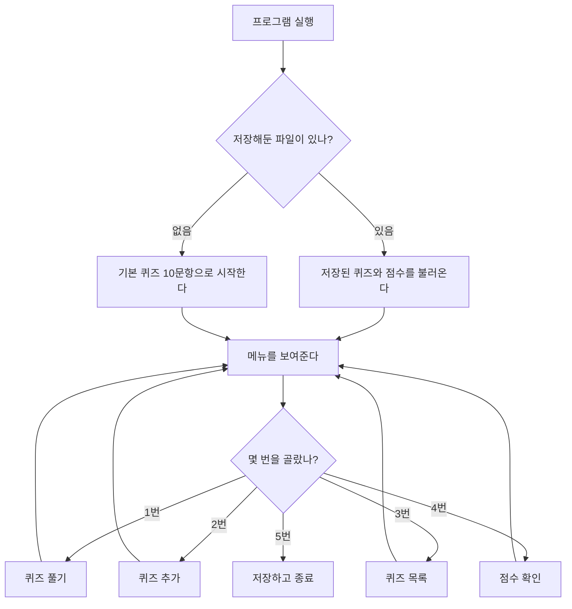
```mermaid
flowchart TD
    A["프로그램 실행"] --> B{"저장해둔 파일이 있나?"}
    B -->|"있음"| C["저장된 퀴즈와 점수를 불러온다"]
    B -->|"없음"| D["기본 퀴즈 10문항으로 시작한다"]
    C --> E["메뉴를 보여준다"]
    D --> E
    E --> F{"몇 번을 골랐나?"}
    F -->|"1번"| G["퀴즈 풀기"]
    F -->|"2번"| H["퀴즈 추가"]
    F -->|"3번"| I["퀴즈 목록"]
    F -->|"4번"| J["점수 확인"]
    F -->|"5번"| K["저장하고 종료"]
    G --> E
    H --> E
    I --> E
    J --> E
```

## 퀴즈 주제와 선정 이유

주제는 뮤지컬이에요. 제가 뮤지컬 전공이라 아는 분야고, 뭐가 헷갈리는 문제인지
감이 있어서 골랐어요.

만들다 보니 4지선다에 잘 맞는 주제였어요. 작곡가나 원작 소설, 대표 넘버는
정답이 하나로 딱 떨어지고, 오답 선택지도 만들기 쉬워요. 앤드루 로이드 웨버 자리에
스티븐 손드하임을 넣으면 그럴듯해 보여서 찍어서 맞히기 어려워져요.

기본 문항은 10개고, 게임 안에서 더 추가할 수 있어요.

## 실행 방법

```bash
cd python-quiz-game
python quiz_game.py
```

Windows 에서 `python` 이 안 잡히면 `py quiz_game.py` 로 실행해요.

첫 실행에는 저장 파일이 없어서 기본 10문항으로 시작하고,
두 번째부터는 저장된 내용을 불러와요.

```
[안내] 저장된 데이터가 없습니다.
[안내] 기본 퀴즈로 시작합니다.
```

```
[알림] 저장된 데이터를 불러왔습니다. (퀴즈 11개, 최고 기록 10문제 정답)
```

## 실행 화면

실제로 돌려서 나온 화면이에요.

**메뉴** — 저장된 내용을 불러오고 메뉴를 띄워요.

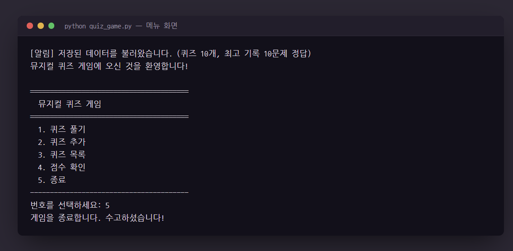

**퀴즈 추가** — 문제와 선택지 4개, 정답 번호를 받아 등록하고 바로 저장해요.

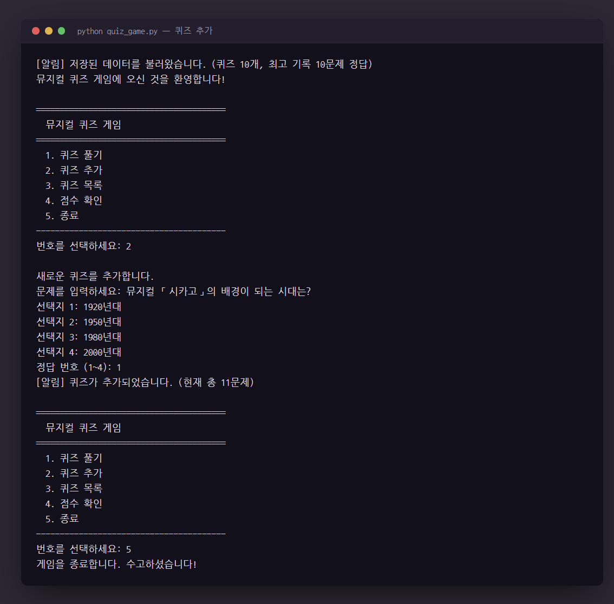

**퀴즈 목록** — 등록된 문항을 번호와 함께 보여줘요.

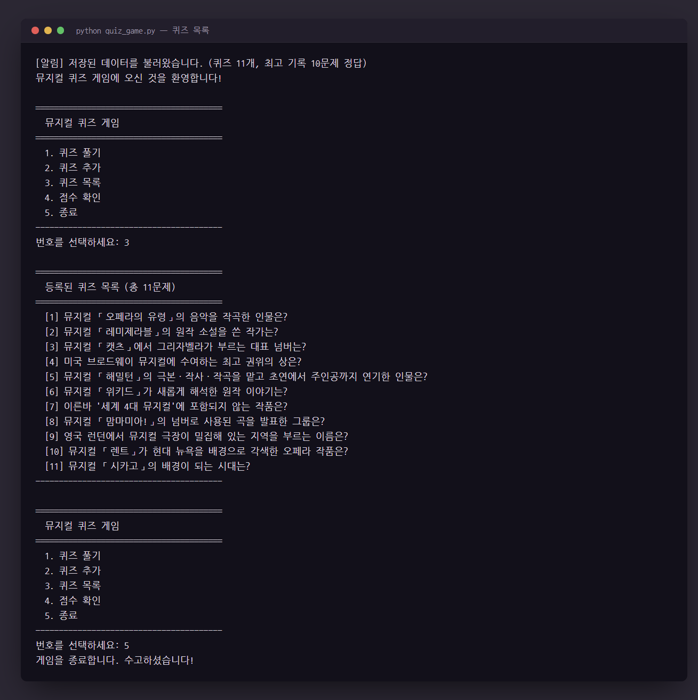

**퀴즈 풀기** — 한 문제씩 내고 바로 채점해요. 다 풀면 맞힌 개수와 정답률이 나와요.

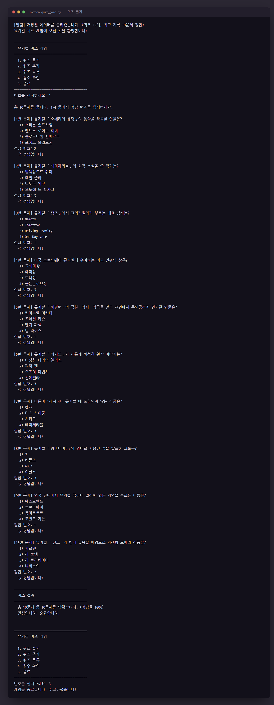

**점수 확인** — 지금까지 최고 기록이에요.

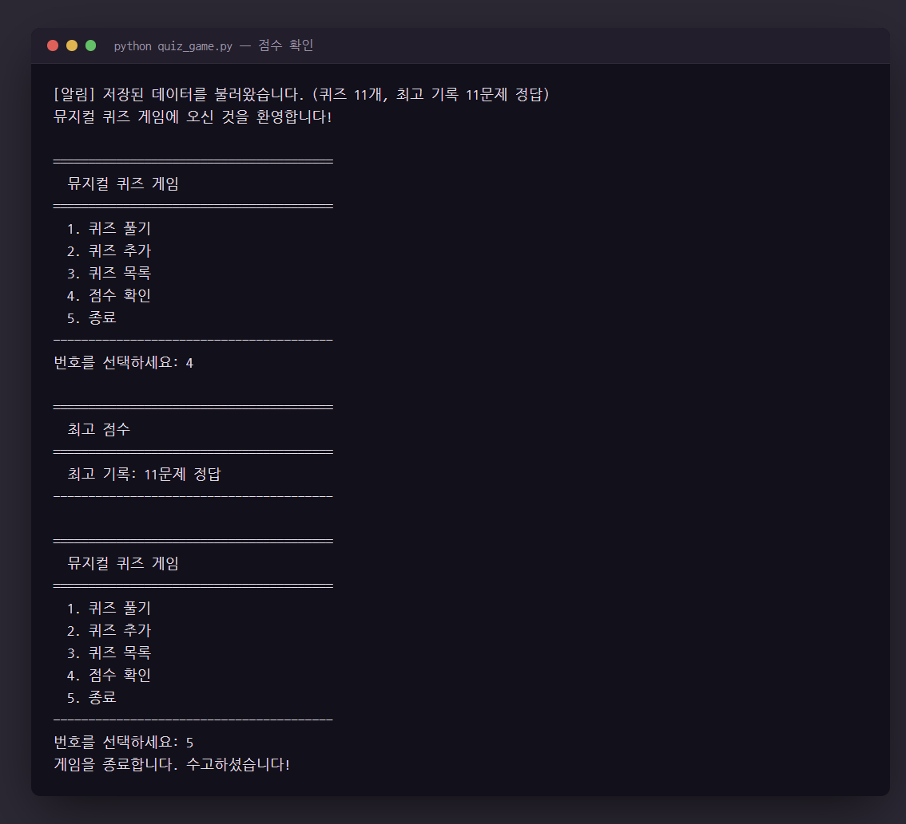

**잘못된 입력** — 숫자가 아닌 값, 범위 밖 숫자, 빈 입력을 걸러내고 다시 물어봐요.

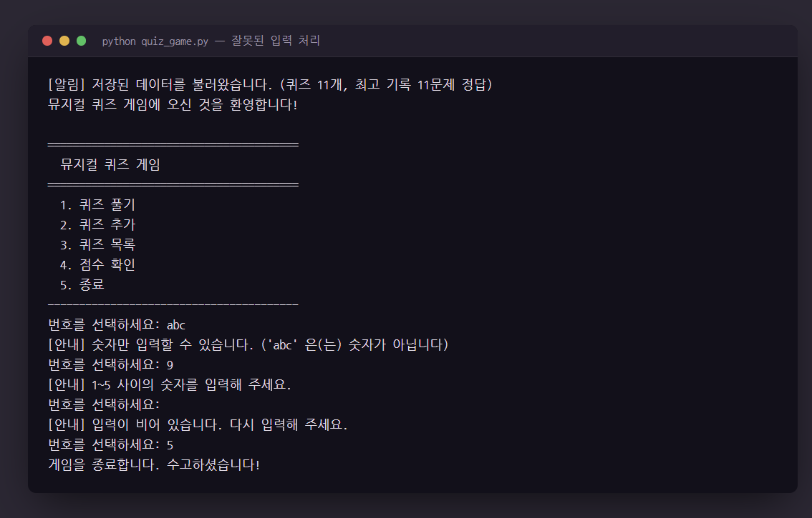

**개발 환경**

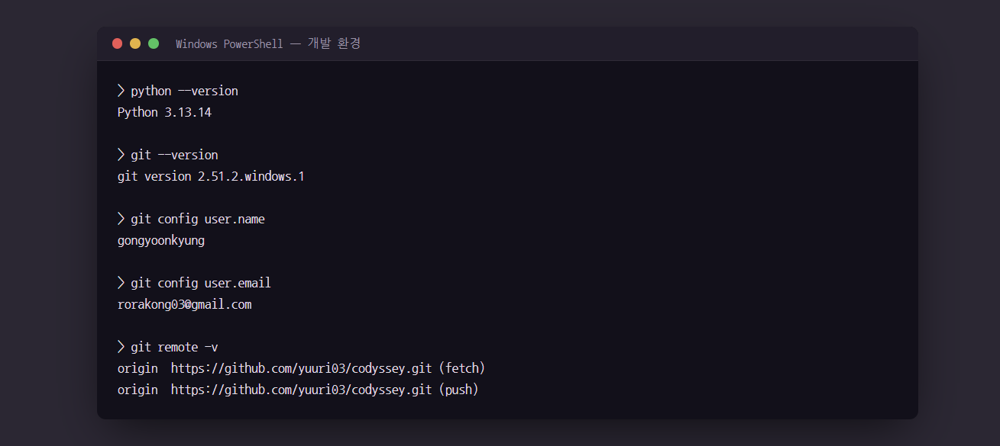

## 기능 목록

| 번호 | 기능 | 하는 일 |
|---|---|---|
| 1 | 퀴즈 풀기 | 등록된 퀴즈를 순서대로 내고 바로 채점해요. 끝나면 정답률과 최고 점수 갱신 여부를 보여줘요 |
| 2 | 퀴즈 추가 | 문제·선택지 4개·정답 번호를 받아 등록하고 저장해요 |
| 3 | 퀴즈 목록 | 등록된 문항을 번호와 함께 한 줄씩 보여줘요 |
| 4 | 점수 확인 | 최고 기록을 보여줘요. 아직 안 풀었으면 그렇게 알려줘요 |
| 5 | 종료 | 현재 상태를 저장하고 끝내요 |

### 잘못된 입력 처리

숫자를 받는 자리는 전부 같은 함수를 거쳐요. 아래를 걸러내고 다시 입력받아요.

- 앞뒤 공백 제거 — `  4  ` 도 4로 받아요
- 빈 입력 (그냥 Enter)
- `abc` 처럼 숫자로 못 바꾸는 값
- 범위 밖 숫자 — 메뉴에서 `9`, 정답 번호로 `0`

제대로 된 값이 들어올 때까지 계속 되물어서, 몇 번을 잘못 쳐도 안 죽어요.

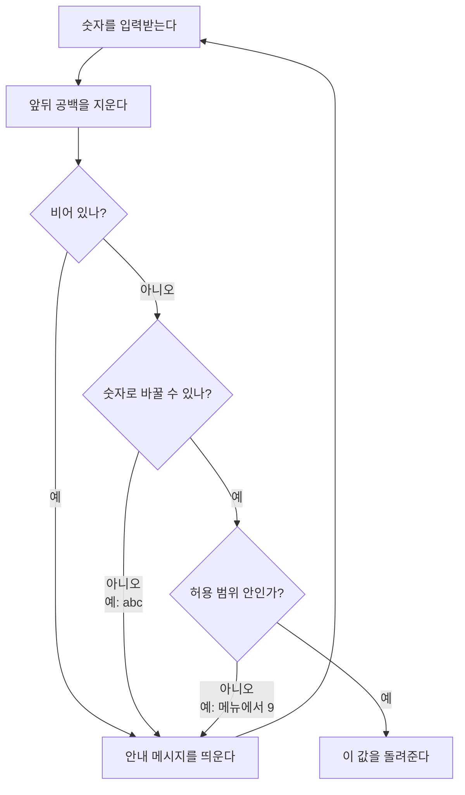
```mermaid
flowchart TD
    A["숫자를 입력받는다"] --> B["앞뒤 공백을 지운다"]
    B --> C{"비어 있나?"}
    C -->|"예"| M["안내 메시지를 띄운다"]
    C -->|"아니오"| D{"숫자로 바꿀 수 있나?"}
    D -->|"아니오<br/>예: abc"| M
    D -->|"예"| E{"허용 범위 안인가?"}
    E -->|"아니오<br/>예: 메뉴에서 9"| M
    E -->|"예"| F["이 값을 돌려준다"]
    M --> A
```

파일 쪽 문제도 프로그램이 죽지 않게 처리했어요. 살릴 수 있는 걸 최대한 살리고,
정말 안 될 때만 처음 상태로 돌아가는 순서예요.

| 순위 | 상황 | 하는 일 |
|---|---|---|
| 1 | 문항 하나가 깨짐 | 그 문항만 버리고 나머지는 살려요 |
| 2 | `state.json` 전체가 깨짐 | `state.json.bak` 에서 읽어요 |
| 3 | 백업도 깨짐 | 기본 퀴즈 10문항으로 시작해요 |
| 4 | 저장 실패 | 안내만 하고 게임은 계속 돌려요 |

Ctrl+C 나 입력이 끊기면 파이썬 오류를 그대로 띄우지 않고, 안내한 뒤
지금까지 내용을 저장하고 종료해요.

로그 파일은 안 만들어요. 콘솔 프로그램이라 화면에 바로 띄우는 걸로 충분해요.
`[안내]` 는 뭔가 잘 안 된 상황, `[알림]` 은 정상적으로 일어난 일이에요.

## Git 작업 기록

### 커밋

기능 하나를 끝낼 때마다 하나씩 커밋했어요. 전체 35개고, 이 미션에 해당하는 게 32개예요.

```
58ed990 Chore: 저장소 초기화 및 .gitignore, README 뼈대 추가
8a9180a Feat: 메뉴 출력 및 종료 기능 구현
3b493d9 Refactor: 숫자 입력 검증을 공통 헬퍼 ask_int() 로 분리
ac17f12 Feat: Quiz 클래스 구현 (문제, 선택지 4개, 정답 번호 관리)
58bc872 Feat: 파이썬 기초 주제 기본 퀴즈 8문항 추가
019e655 Refactor: 게임 진행 로직을 QuizGame 클래스로 이동
b169463 Feat: 퀴즈 풀기 기능 구현 (출제, 채점, 결과 표시)
0c3d39d Merge: feature/play-quiz 브랜치의 퀴즈 풀기 기능을 main 에 병합
a46ac87 Feat: 퀴즈 주제를 뮤지컬로 교체하고 기본 문항 10개 작성
85695a3 Feat: 퀴즈 추가 기능 구현
12e210d Feat: 퀴즈 목록 기능 구현
0f7cb7c Feat: 최고 점수 확인 및 갱신 기능 구현
a690f9b Feat: state.json 파일 저장/불러오기 구현 (데이터 영속성)
71b0408 Feat: Ctrl+C / 입력 종료 시 안전하게 저장하고 종료하도록 처리
f1b841b Docs: README 전체 작성
70dde5f Fix: 선택지가 서로 중복되면 퀴즈 생성을 거부하도록 검증 추가
d20f75f Feat: 저장 파일 백업과 복구 기능 추가
027fcfb Fix: 저장 중 인코딩 오류가 나도 프로그램이 죽지 않도록 처리
```

```bash
git log --oneline            # 전체 목록
git rev-list --count HEAD    # 커밋 개수
```

### 커밋 메시지 규칙

`말머리: 한 줄 요약` 형태로 통일했어요.

| 말머리 | 언제 | 예 |
|---|---|---|
| `Feat` | 기능을 새로 만들었을 때 | `Feat: 퀴즈 목록 기능 구현` |
| `Fix` | 잘못 동작하던 걸 고쳤을 때 | `Fix: 점수 계산 오류 수정` |
| `Refactor` | 동작은 그대로고 구조만 바꿨을 때 | `Refactor: QuizGame 책임 분리` |
| `Docs` | 문서만 고쳤을 때 | `Docs: README 실행 방법 추가` |
| `Chore` | 설정이나 정리 작업 | `Chore: 미션별 폴더로 구조 정리` |

요약 줄에는 뭘 했는지 적고, 왜 했는지는 본문에 `-` 로 나열해요.

```
Fix: 저장 중 인코딩 오류가 나도 프로그램이 죽지 않도록 처리

- 콘솔 인코딩과 맞지 않는 글자가 입력되면 json.dump 에서 UnicodeEncodeError 가 났다
- OSError 만 잡고 있어서 예외가 밖으로 나가 트레이스백을 띄우며 비정상 종료했다
- UnicodeEncodeError 도 함께 잡아 안내만 출력하고 게임을 계속하도록 바꾼다
```

커밋 하나에 기능 하나만 담고, `수정` 이나 `update` 처럼 나중에 봐서 모르는
메시지는 안 썼어요.

### 브랜치와 병합

`퀴즈 풀기` 기능은 `feature/play-quiz` 브랜치에서 만들고 `main` 에 병합했어요.

```bash
git checkout -b feature/play-quiz   # 브랜치 만들고 이동
# 기능 구현하고 커밋
git checkout main
git merge feature/play-quiz
```

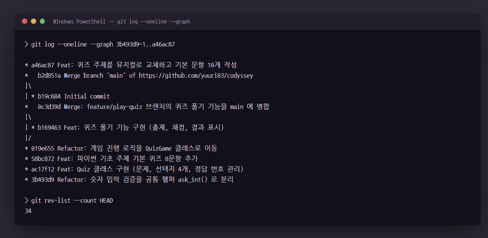

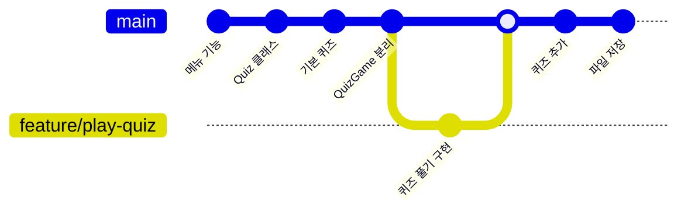
```mermaid
gitGraph
    commit id: "메뉴 기능"
    commit id: "Quiz 클래스"
    commit id: "기본 퀴즈"
    commit id: "QuizGame 분리"
    branch feature/play-quiz
    commit id: "퀴즈 풀기 구현"
    checkout main
    merge feature/play-quiz
    commit id: "퀴즈 추가"
    commit id: "파일 저장"
```

브랜치를 쓰는 이유는 **만들다 만 코드가 `main` 에 안 들어가게** 하려는 거예요.
퀴즈 풀기를 만드는 중간에는 채점이 반만 되는 상태였는데, 그게 `main` 에 있으면
`main` 을 받은 사람은 고장난 프로그램을 받게 돼요.

되돌리기도 쉬워요. 기능 하나가 통째로 브랜치에 담겨 있으면 병합 커밋 하나만
되돌리면 되거든요. 여럿이 같은 파일을 동시에 고칠 때는 아예 필수고요.

집 전체를 쓰면서 거실을 뜯어고치면 그동안 아무도 거실을 못 쓰잖아요.
방 하나 따로 빌려서 다 만든 다음 옮겨오면 그동안에도 집은 멀쩡해요.

### clone 과 pull

원격 저장소를 다른 폴더에 복제해서, 거기서 고친 걸 원래 폴더로 받아왔어요.

**1) 별도 폴더에 clone**

```bash
git clone https://github.com/yuuri03/codyssey.git codyssey-clone
```

```
Cloning into 'codyssey-clone'...
```

**2) 복제한 쪽에서 고치고 commit → push**

```bash
git commit -m "Docs: 공통 사항에 커밋과 브랜치 작업 방식을 한 줄 추가"
git push origin main
```

```
[main da3ef63] Docs: 공통 사항에 커밋과 브랜치 작업 방식을 한 줄 추가
 1 file changed, 1 insertion(+)
To https://github.com/yuuri03/codyssey.git
   6b382a2..da3ef63  main -> main
```

**3) 원래 폴더에서 pull**

```bash
git pull origin main
```

```
Updating 6b382a2..da3ef63
Fast-forward
 README.md | 1 +
 1 file changed, 1 insertion(+)
```

`clone` 은 원격 저장소를 통째로 복제해 새 폴더를 만드는 거고,
`pull` 은 이미 있는 폴더에 변경분만 받아오는 거예요.
그래서 처음 받을 때만 `clone`, 그다음부터는 `pull` 을 써요.

### 쓴 명령어 정리

만들면서 쓴 Git 명령어예요. 처음엔 뭐가 뭔지 헷갈려서 적어두고 봤어요.

| 명령어 | 하는 일 | 이 저장소에서 |
|---|---|---|
| `init` | 폴더를 저장소로 만든다 | 처음 시작할 때 (`58ed990`) |
| `add` | 커밋할 변경을 고른다 | 커밋할 때마다 |
| `commit` | 고른 변경을 확정한다 | 35회 |
| `push` | 원격 저장소에 올린다 | 커밋하고 나서 |
| `pull` | 원격의 변경분을 받아온다 | 복제본에서 올린 걸 받을 때 (`b2d851a`) |
| `checkout` | 브랜치를 오간다 | `feature/play-quiz` 만들고 오갈 때 |
| `clone` | 원격 저장소를 통째로 복제한다 | 실습용 복제본 만들 때 |

`add` 랑 `commit` 이 왜 따로 있는지 처음엔 몰랐어요.
바꾼 것 **전부**가 아니라 관련된 것만 골라서 한 커밋으로 묶으라고 나눠둔 거더라고요.

## 파일 구조

```
codyssey/
├── .gitignore               state.json 같은 실행 결과물을 제외해요
├── README.md                저장소 전체 안내
├── docs/screenshots/        실행 화면
├── python-quiz-game/        이 미션
│   ├── quiz_game.py         프로그램 전체
│   ├── state.json           퀴즈와 최고 점수. 실행하면 생기고 git 엔 안 올라가요
│   ├── state.json.bak       직전 저장 내용 백업
│   └── README.md            이 문서
└── mini-npu-simulator/      다른 미션
```

`quiz_game.py` 안은 이렇게 나눠 놨어요.

- 상수 — `TITLE`, `MENU_ITEMS`, `CHOICE_COUNT`, `STATE_FILE`, `BACKUP_FILE`,
  `TEMP_FILE`, `DEFAULT_QUIZ_DATA`
- `Quiz` 클래스 — 문제 한 개. 값 검증, 화면 출력, 채점, JSON 변환
- `QuizGame` 클래스 — 퀴즈 목록과 최고 점수를 들고 메뉴 진행, 저장, 불러오기
- 입력 헬퍼 — `ask_int()`, `ask_text()`, `read_menu_choice()`
- 그 외 — `default_quizzes()`, `main()`, `finish_early()`

### 두 클래스가 각각 맡는 일

`Quiz` 는 **시험지 한 장**, `QuizGame` 은 **감독관**이에요.
시험지는 자기 정답만 알고, 감독관은 시험지가 몇 장인지와 최고 점수를 알아요.
감독관이 정답을 훔쳐보지 않고 "이거 맞았어?" 하고 물어보는 게 핵심이에요.

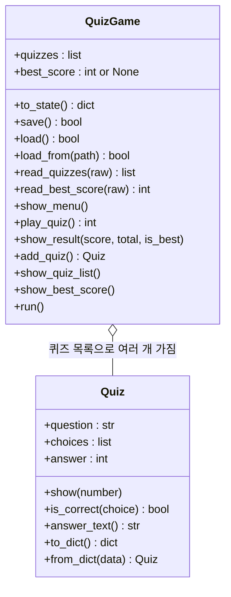
```mermaid
classDiagram
    class Quiz {
        +question : str
        +choices : list
        +answer : int
        +show(number)
        +is_correct(choice) bool
        +answer_text() str
        +to_dict() dict
        +from_dict(data) Quiz
    }
    class QuizGame {
        +quizzes : list
        +best_score : int or None
        +to_state() dict
        +save() bool
        +load() bool
        +load_from(path) bool
        +read_quizzes(raw) list
        +read_best_score(raw) int
        +show_menu()
        +play_quiz() int
        +show_result(score, total, is_best)
        +add_quiz() Quiz
        +show_quiz_list()
        +show_best_score()
        +run()
    }
    QuizGame o-- Quiz : 퀴즈 목록으로 여러 개 가짐
```

경계를 나눈 기준은 **"이 정보를 누가 알고 있어야 하나"** 예요.
정답 번호는 문제 한 개만 알면 되니까 `Quiz` 가 갖고, 최고 점수는 게임 전체가
알아야 하니까 `QuizGame` 이 가져요. 그래서 `QuizGame` 은 `quiz.answer` 를 직접
꺼내지 않고 `quiz.is_correct(번호)` 를 불러요. 판정 규칙이 바뀌어도
`Quiz` 안에서만 고치면 되게요.

### 호출 흐름

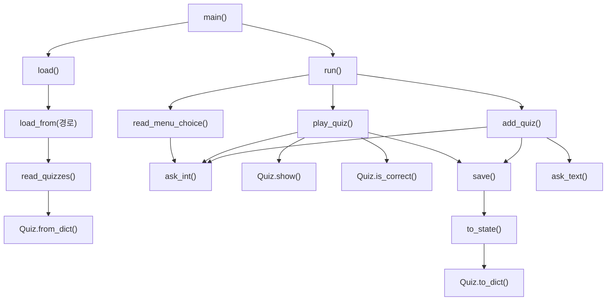
```mermaid
flowchart TD
    M["main()"] --> L["load()"]
    M --> R["run()"]
    L --> LF["load_from(경로)"]
    LF --> RQ["read_quizzes()"]
    RQ --> FD["Quiz.from_dict()"]
    R --> RMC["read_menu_choice()"]
    R --> PQ["play_quiz()"]
    R --> AQ["add_quiz()"]
    RMC --> AI["ask_int()"]
    PQ --> SH["Quiz.show()"]
    PQ --> IC["Quiz.is_correct()"]
    PQ --> AI
    PQ --> SV["save()"]
    AQ --> AT["ask_text()"]
    AQ --> AI
    AQ --> SV
    SV --> TS["to_state()"]
    TS --> TD["Quiz.to_dict()"]
```

`ask_int()` 로 화살표가 **세 군데에서** 들어와요. 메뉴 번호, 정답 번호,
퀴즈 추가할 때 정답 번호요. 숫자 받는 자리는 전부 이 함수 하나를 거쳐요.
올바른 값을 받기 전엔 안 돌아오니까, 부르는 쪽은 "받은 값은 이미 검증된 것"
이라고 믿고 쓸 수 있어요.

문제 하나를 채점하는 동안 오가는 순서예요.

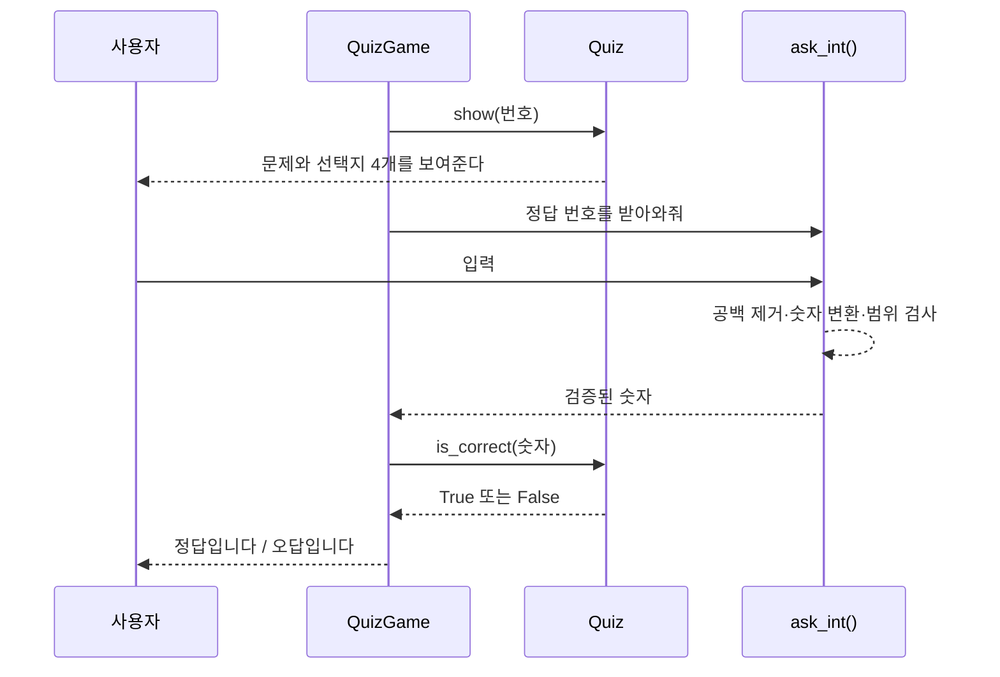
```mermaid
sequenceDiagram
    participant U as 사용자
    participant G as QuizGame
    participant Q as Quiz
    participant A as ask_int()

    G->>Q: show(번호)
    Q-->>U: 문제와 선택지 4개를 보여준다
    G->>A: 정답 번호를 받아와줘
    U->>A: 입력
    A-->>A: 공백 제거·숫자 변환·범위 검사
    A-->>G: 검증된 숫자
    G->>Q: is_correct(숫자)
    Q-->>G: True 또는 False
    G-->>U: 정답입니다 / 오답입니다
```

화면 출력 → 입력 검증 → 게임 진행 → 저장이 한 방향으로만 흘러요.
저장 쪽에서 화면을 부르거나 입력을 받는 일은 없어요.

## 데이터 파일 설명 (state.json)

- 경로는 `python-quiz-game/state.json`, `quiz_game.py` 와 같은 자리예요.
  `__file__` 기준이라 어느 폴더에서 실행해도 같은 파일을 써요.
- 인코딩은 UTF-8. `ensure_ascii=False` 로 한글이 그대로 보이게 저장해요.
- `.gitignore` 로 저장소엔 안 올려요. 사람마다 내용이 달라서 소스가 아니라
  실행 결과물이라고 봤어요.

### 필드 구조

| 키 | 타입 | 설명 |
|---|---|---|
| `quizzes` | 배열 | 퀴즈 목록 |
| `quizzes[].question` | 문자열 | 문제 내용. 빈 값 불가 |
| `quizzes[].choices` | 문자열 배열 | 선택지 4개. 빈 값·중복 불가 |
| `quizzes[].answer` | 정수 | 정답 번호 1~4 |
| `best_score` | 정수 또는 `null` | 최고로 맞힌 문제 수 |

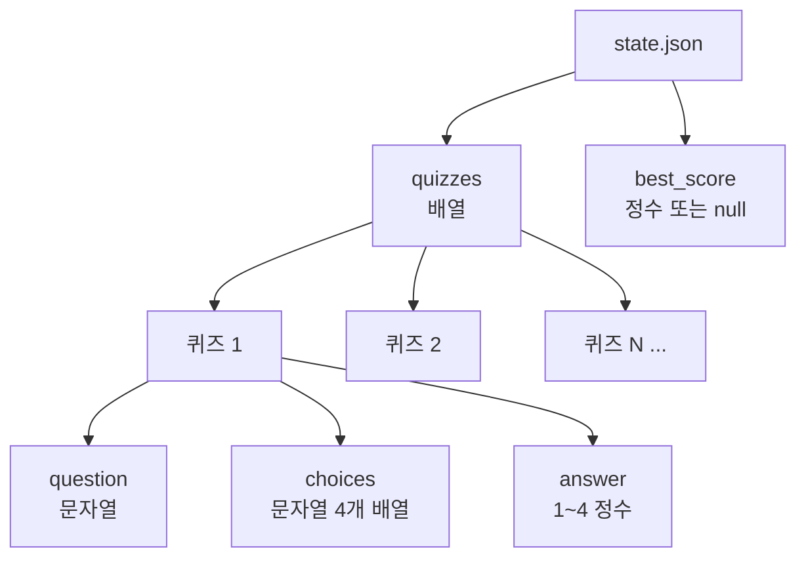
```mermaid
flowchart TD
    R["state.json"] --> Q["quizzes<br/>배열"]
    R --> B["best_score<br/>정수 또는 null"]
    Q --> Q1["퀴즈 1"]
    Q --> Q2["퀴즈 2"]
    Q --> QN["퀴즈 N ..."]
    Q1 --> F1["question<br/>문자열"]
    Q1 --> F2["choices<br/>문자열 4개 배열"]
    Q1 --> F3["answer<br/>1~4 정수"]
```

```json
{
  "quizzes": [
    {
      "question": "뮤지컬 「오페라의 유령」의 음악을 작곡한 인물은?",
      "choices": ["스티븐 손드하임", "앤드루 로이드 웨버", "클로드미셸 쇤베르크", "프랭크 와일드혼"],
      "answer": 2
    }
  ],
  "best_score": 9
}
```

`best_score` 를 0이 아니라 `null` 로 둔 이유가 있어요. 아직 한 번도 안 풀어본
상태랑, 풀었는데 0점인 건 다른 상태거든요. 둘 다 0이면 점수 화면에서 구분이 안 돼요.

### 언제 저장되나

읽기는 시작할 때 한 번, 쓰기는 네 군데예요. 매번 파일 전체를 새로 써요.

| 시점 | 부르는 곳 |
|---|---|
| 퀴즈를 추가했을 때 | `add_quiz()` |
| 최고 점수를 넘겼을 때 | `play_quiz()` |
| 메뉴 5번 종료 | `run()` |
| Ctrl+C 나 입력 끊김 | `finish_early()` |

최고 점수를 못 넘긴 회차는 저장 안 해요. 바뀐 게 없으니까요.

### 저장 파일이 깨지지 않게 하는 방법

`state.json` 을 바로 열어서 쓰면 위험해요. 파일을 여는 순간 기존 내용이 비워지는데,
다 쓰기 전에 멈추면 반쯤 쓰인 파일만 남고 이전 내용까지 날아가요.

원고를 고쳐 쓰는 것에 비유하면, 원본에 바로 덧칠하는 대신 새 종이에 다 옮겨 적고
원본을 서랍에 넣은 다음 새 종이를 그 자리에 두는 거예요.

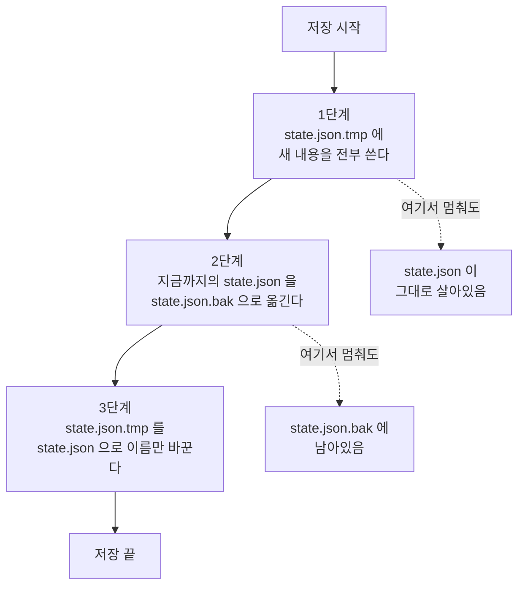
```mermaid
flowchart TD
    S["저장 시작"] --> T["1단계<br/>state.json.tmp 에<br/>새 내용을 전부 쓴다"]
    T --> U["2단계<br/>지금까지의 state.json 을<br/>state.json.bak 으로 옮긴다"]
    U --> V["3단계<br/>state.json.tmp 를<br/>state.json 으로 이름만 바꾼다"]
    V --> W["저장 끝"]
    T -.->|"여기서 멈춰도"| X["state.json 이<br/>그대로 살아있음"]
    U -.->|"여기서 멈춰도"| Y["state.json.bak 에<br/>남아있음"]
```

2단계와 3단계는 `os.replace()` 를 써요. 이름만 바꾸는 거라 끊길 틈이 거의 없어요.
어느 단계에서 멈춰도 온전한 파일이 최소 하나는 남아요.

백업은 **한 세대만** 보관해요. 퀴즈 게임이라 잃어버려도 문제 몇 개와 점수 정도고,
파일이 계속 쌓이면 관리가 번거로워서요.

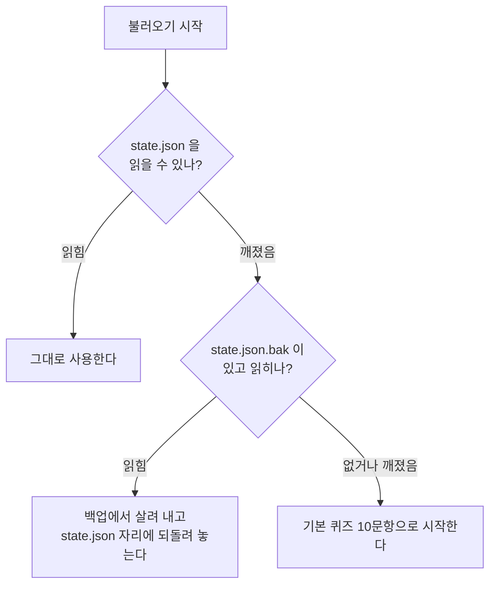
```mermaid
flowchart TD
    A["불러오기 시작"] --> B{"state.json 을<br/>읽을 수 있나?"}
    B -->|"읽힘"| C["그대로 사용한다"]
    B -->|"깨졌음"| D{"state.json.bak 이<br/>있고 읽히나?"}
    D -->|"읽힘"| E["백업에서 살려 내고<br/>state.json 자리에 되돌려 놓는다"]
    D -->|"없거나 깨졌음"| F["기본 퀴즈 10문항으로 시작한다"]
```

```
[안내] 저장 파일이 손상되어 읽을 수 없습니다.
[안내] 백업 파일로 다시 시도합니다.
[알림] 저장된 데이터를 불러왔습니다. (퀴즈 10개, 최고 기록 7문제 정답)
```

## 왜 이렇게 만들었나

### 왜 함수 말고 클래스로 했나

함수만으로도 돌아가요. 차이는 **검증을 한 곳에 모을 수 있느냐**예요.

문제 하나를 딕셔너리로 들고 다녔다면, "선택지가 4개인가, 비어있진 않은가"
확인하는 코드를 퀴즈 만드는 자리마다 써야 해요. 기본 퀴즈 만들 때,
사용자가 추가할 때, 파일에서 읽을 때 세 번이요.

`Quiz.__init__()` 에 검증을 넣으니 한 곳으로 모였어요.
**`Quiz` 가 만들어졌다는 건 곧 검증을 통과했다는 뜻**이라, 그 뒤 코드에서는
다시 확인 안 해도 돼요.

실제로 `70dde5f` 에서 "선택지가 서로 중복되면 안 된다" 는 규칙을 나중에 추가했는데,
`__init__` 한 곳만 고치니 세 경로에 전부 적용됐어요.

테스트도 편해요. `Quiz("문제", ["가","나","다","라"], 2).is_correct(2)` 처럼
게임을 실행하지 않고 문제 하나만 떼서 확인할 수 있어요.

### 왜 JSON 으로 저장했나

| 형식 | 장점 | 단점 |
|---|---|---|
| JSON | 표준 라이브러리로 되고, 열어서 눈으로 확인돼요 | 텍스트라 바이너리보다 조금 커요 |
| pickle | 파이썬 객체를 그대로 저장해요 | 열어봐도 못 읽고, 남의 파일을 읽으면 위험해요 |
| CSV | 더 가벼워요 | 선택지 4개가 한 칸에 들어가야 해서 구조가 안 맞아요 |

세 가지 이유로 JSON 을 골랐어요.

첫째, `import json` 만 하면 돼요. 외부 라이브러리 없이 만들기로 해서
설치 없이 바로 되는 게 중요했어요.

둘째, **중첩 구조**에 맞아요. 문제 하나가 문자열·목록·숫자를 갖는 모양인데,
CSV 는 한 줄에 칸을 나열하는 방식이라 목록을 넣기 어색해요.

셋째, **직접 열어볼 수 있어요.** 잘 저장됐는지 파일을 열어 확인하고,
오타가 있으면 손으로 고칠 수도 있어요. 퀴즈 10개에 2KB 정도라
텍스트라서 커진다는 단점이 문제될 규모가 아니었어요.

### 필드가 바뀌면

지금은 저장 파일에 형식 번호를 안 적어 놨어요. 필드가 몇 개 안 돼서요.

**필드를 더하기만 할 때**는 지금 코드로도 돼요. `read_quizzes()` 가
`question`, `choices`, `answer` 만 확인하고 나머지 키는 무시하거든요.
힌트를 넣는다고 `hint` 를 추가해도 옛날 파일이 안 깨져요.

**이름을 바꾸거나 없앨 때**는 옛날 파일을 못 읽어요. 그때는 `"version": 2`
같은 키를 넣고, `load_from()` 에서 번호를 보고 옛 형식을 새 형식으로 바꿔
읽는 함수를 거치게 하면 돼요.

## 퀴즈가 많아지면

퀴즈를 전부 메모리에 올려놓고, 저장할 때마다 파일 전체를 다시 써요.
문항이 많아지면 어디서부터 문제가 되는지 직접 재봤어요.

| 문항 | 파일 크기 | 저장 | 불러오기 |
|---|---|---|---|
| 10 | 2.4 KB | 1.18 ms | 0.18 ms |
| 100 | 24.2 KB | 2.32 ms | 0.42 ms |
| 1,000 | 246.6 KB | 10.37 ms | 5.81 ms |
| 10,000 | 2,514 KB | 115.54 ms | 47.14 ms |

문항 수에 거의 정비례해요. 파일 전체를 매번 새로 쓰고 통째로 읽으니까요.

**1000개까지는 괜찮아요.** 저장이 10ms 라 사람이 못 느껴요.

**문제가 되는 건 속도보다 화면이에요.** 1000개면 목록이 1000줄 쏟아져서
위쪽은 스크롤로 사라지고, 퀴즈 풀기는 1000문제를 전부 내니까 끝까지 풀 수가 없어요.
저장 방식과 상관없이 지금 구현이 "전부 보여주고 전부 출제한다" 라서 생기는 한계예요.

**10000개부터는 저장도 느껴져요.** 115ms 면 멈칫하는 게 보이고, 백업까지 5MB 예요.

| 문항 수 | 손볼 것 |
|---|---|
| ~1000개 | 목록을 20개씩 끊어 보여주기, 풀 문제 수 고르기 |
| ~10000개 | 파일 전체 대신 바뀐 부분만 쓰기 |
| 그 이상 | JSON 대신 SQLite 로 옮기기 |

검색을 붙인다면 지금은 목록을 처음부터 훑는 수밖에 없어요. 문제 내용을 키로 하는
딕셔너리를 들고 있으면 바로 찾을 수 있는데, 1000개 훑는 데 1ms 도 안 걸려서
지금 넣으면 관리할 것만 늘어요.

## 뭘 바꾸고 싶을 때 어디를 고치면 되나

전부 `quiz_game.py` 안이에요.

| 바꾸고 싶은 것 | 고칠 자리 |
|---|---|
| 점수 계산 방식 | `play_quiz()` 의 `score += 1`, `show_result()` 의 `percent` |
| 최고 점수 기준 | `play_quiz()` 의 `is_best` 판단 줄 |
| 선택지 개수 (4개 → 5개) | 상수 `CHOICE_COUNT` 한 줄 |
| 문제에 붙는 정보 (힌트 등) | `Quiz.__init__()`, `to_dict()`, `from_dict()` |
| 문제·선택지 검증 규칙 | `Quiz.__init__()` |
| 메뉴 항목 추가·삭제 | 상수 `MENU_ITEMS` 와 `run()` 의 분기 |
| 기본 퀴즈 내용 | 상수 `DEFAULT_QUIZ_DATA` |
| 저장 파일 위치·이름 | 상수 `STATE_FILE`, `BACKUP_FILE`, `TEMP_FILE` |
| 저장 형식 | `save()`, `load_from()`, `to_state()` |
| 입력 안내 문구 | `ask_int()`, `ask_text()` |

점수와 문제 구조가 서로 다른 자리에 있는 게 중요해요.
점수 규칙을 바꿔도 `Quiz` 는 안 건드리고, 문제에 힌트를 붙여도
채점 부분은 그대로예요.

## 저장소

- GitHub: https://github.com/yuuri03/codyssey
- Codyssey 입학연수 '개발 입문' 미션으로 만들었어요.
